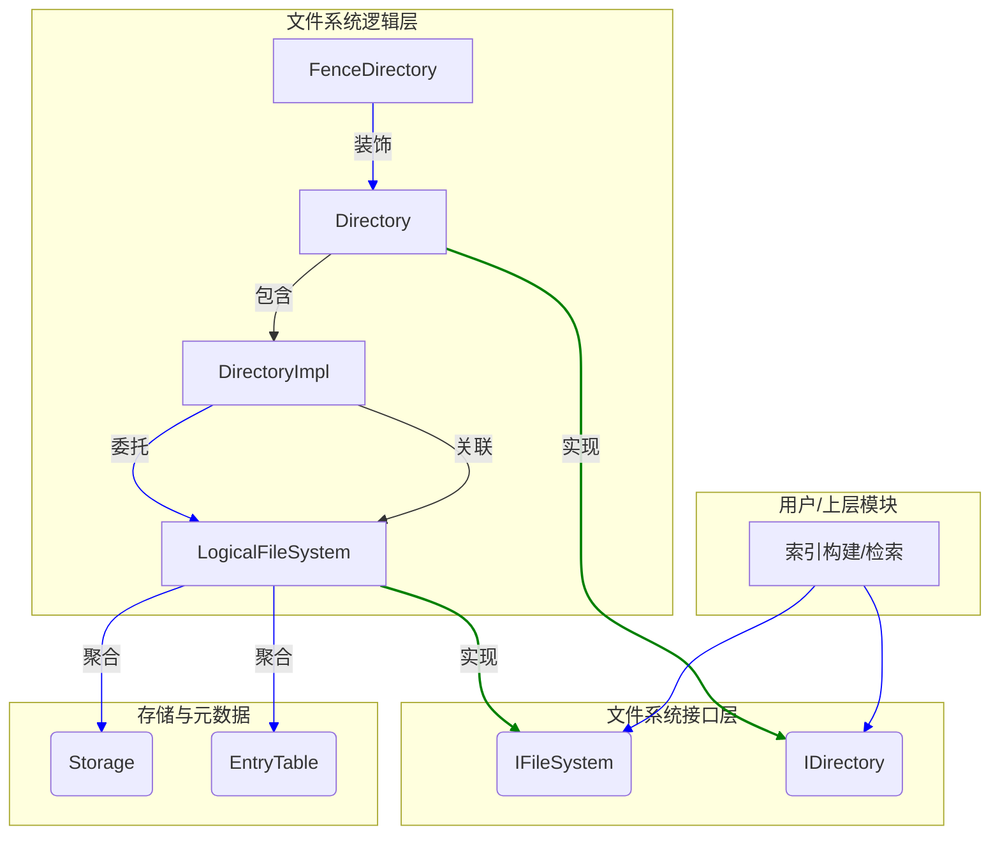

# Indexlib 文件系统核心：文件系统与目录管理

**涉及文件:**
* `file_system/IFileSystem.h`
* `file_system/LogicalFileSystem.h`
* `file_system/LogicalFileSystem.cpp`
* `file_system/FileSystemCreator.h`
* `file_system/FileSystemCreator.cpp`
* `file_system/IDirectory.h`
* `file_system/Directory.h`
* `file_system/Directory.cpp`
* `file_system/DirectoryImpl.h`
* `file_system/DirectoryImpl.cpp`
* `file_system/FenceDirectory.h`
* `file_system/FenceDirectory.cpp`
* `file_system/FileSystemDefine.h`
* `file_system/ErrorCode.h`
* `file_system/FSResult.h`

## 1. 概述

Indexlib 的文件系统模块是其存储系统的基石，为上层索引的构建、合并和检索提供了统一的、与物理存储无关的视图。本篇文档将深入剖析文件系统的核心组件——`IFileSystem`、`LogicalFileSystem` 以及与之紧密相关的目录管理类，揭示其设计理念、关键实现与技术考量。

该模块的核心设计目标是：

*   **抽象与解耦**: 将文件操作与底层物理存储（如本地磁盘、Pangu、HDFS 等）解耦，提供统一的逻辑视图。
*   **高性能**: 针对索引场景进行优化，支持内存文件、MMap、块缓存等多种访问方式，并提供异步操作能力。
*   **可扩展性**: 易于扩展以支持新的存储介质和文件类型。
*   **一致性与隔离**: 通过 `FenceContext` 机制，为并发操作提供隔离和保护，确保数据一致性。
*   **元数据管理**: 维护文件和目录的元信息，支持版本管理和快照。

## 2. 系统架构

文件系统模块的架构可以分为以下几个层次：

1.  **接口层 (`IFileSystem`, `IDirectory`)**: 定义了文件系统和目录的核心操作接口，是上层模块与之交互的契约。
2.  **逻辑层 (`LogicalFileSystem`, `Directory`)**: 实现了接口层的定义，构建了一个逻辑文件树。它不直接进行物理 I/O，而是将操作委托给存储层。`LogicalFileSystem` 是整个文件系统的入口和核心控制器。
3.  **存储层 (`Storage`)**: (在本次分析的文件中未直接体现，但从 `LogicalFileSystem` 的实现中可以看出其存在) 负责与具体的物理存储进行交互，执行实际的文件读写。`LogicalFileSystem` 会根据配置和文件类型，选择不同的 `Storage` 实现（如 `DiskStorage`, `MemStorage` 等）。
4.  **元数据管理 (`EntryTable`)**: (同样在本次分析的文件中未直接体现，但 `LogicalFileSystem` 严重依赖它) 负责维护逻辑文件系统中的所有文件和目录的元信息，如路径、大小、物理位置等。它是实现逻辑视图的关键。
5.  **辅助组件**:
    *   `FileSystemCreator`: 用于创建 `LogicalFileSystem` 实例的工厂类。
    *   `FenceDirectory`: `Directory` 的装饰器，增加了并发控制的能力。
    *   `ErrorCode`, `FSResult`: 统一的错误处理机制。

下图展示了这些组件之间的关系：



## 3. 关键实现细节

### 3.1. `IFileSystem` 与 `LogicalFileSystem`：逻辑视图的核心

`IFileSystem` 是一个纯虚基类，定义了文件系统的所有核心功能。`LogicalFileSystem` 是其主要实现，它通过 `EntryTable` 维护了一个逻辑文件树，将逻辑路径映射到物理存储位置。

#### 3.1.1. 核心职责

*   **生命周期管理**: `Init` 方法根据 `FileSystemOptions` 初始化文件系统，包括设置内存配额、初始化输入/输出 `Storage` 等。
*   **文件和目录操作**: 提供创建、删除、重命名文件和目录的接口。这些操作大多会委托给 `EntryTable` 来更新元数据，并由 `Storage` 来执行物理操作。
*   **版本与挂载**:
    *   `MountVersion`: 挂载一个指定版本的索引，将其内容映射到逻辑文件系统中。这是实现增量加载和版本回滚的基础。
    *   `MountDir`/`MountFile`: 挂载物理路径下的目录或文件到逻辑路径，支持只读和读写模式。这使得可以将外部数据或预置数据集成到文件系统中。
    *   `CommitSelectedFilesAndDir`: 将内存中的修改（新文件、删除等）提交，形成一个新的版本。
*   **度量与监控**: 通过 `FileSystemMetrics` 和 `FileSystemMetricsReporter` 收集和报告文件系统的各项指标，如内存使用、缓存命中率等。

#### 3.1.2. 关键代码分析：`CreateFileWriter`

`CreateFileWriter` 是一个典型的写操作流程，很好地展示了 `LogicalFileSystem` 的工作模式。

```cpp
// in LogicalFileSystem.cpp

FSResult<std::shared_ptr<FileWriter>> LogicalFileSystem::CreateFileWriter(const string& rawPath,
                                                                          const WriterOption& rawWriterOption) noexcept
{
    // ... 参数处理和特殊情况（如 SliceFile） ...

    ScopedLock lock(*_lock);

    bool deleteWhenFail = false;
    string fullPhysicalPath;
    auto [ec, entryMeta] = GetEntryMeta(path);
    if (ec == FSEC_OK) {
        // 文件已存在，根据写入选项决定是报错还是追加
        // ...
    } else if (ec == FSEC_NOENT) {
        // 1. 文件不存在，创建新的 EntryMeta
        auto [ec1, entryMeta1] = CreateEntryMeta(path);
        RETURN2_IF_FS_ERROR(ec1, std::shared_ptr<FileWriter>(), "CreateEntryMeta failed, path[%s]", path.c_str());
        
        // 2. 将新的 EntryMeta 添加到 EntryTable
        auto addRet = _entryTable->AddEntryMeta(entryMeta1);
        RETURN2_IF_FS_ERROR(addRet.ec, std::shared_ptr<FileWriter>(), "entry table add file failed, [%s]",
                            entryMeta1.DebugString().c_str());
        fullPhysicalPath = entryMeta1.GetFullPhysicalPath();
        deleteWhenFail = true;
    } else {
        RETURN2_IF_FS_ERROR(ec, std::shared_ptr<FileWriter>(), "Create file [%s] writer failed", rawPath.c_str());
    }

    // 3. 委托给 Output Storage 创建物理文件的写入器
    auto ret = _outputStorage->CreateFileWriter(path, fullPhysicalPath, writerOption);
    if (ret.ec != FSEC_OK) {
        AUTIL_LOG(ERROR, "Create file [%s] => [%s] writer failed", rawPath.c_str(), fullPhysicalPath.c_str());
        if (deleteWhenFail) {
            // 如果物理文件创建失败，从 EntryTable 中删除元数据
            _entryTable->Delete(path);
        }
    }
    return ret;
}
```

这个过程清晰地展示了“**先更新元数据，再执行物理操作**”的模式。`LogicalFileSystem` 负责协调 `EntryTable` (元数据) 和 `Storage` (物理存储)，确保两者状态的一致性。

### 3.2. `Directory` 体系：面向对象的路径操作

`Directory` 类提供了一个面向对象的接口来操作文件系统中的目录。它封装了对 `IFileSystem` 的调用，使得路径操作更加直观。

*   **`IDirectory`**: 定义了目录操作的接口。
*   **`Directory`**: `IDirectory` 的实现类，内部持有一个 `DirectoryImpl` 的指针。这是一个典型的 Pimpl (Pointer to implementation) 设计模式，将接口与实现分离，减少了头文件依赖。
*   **`DirectoryImpl`**: 实际执行目录操作的类。它持有 `IFileSystem` 的引用和当前目录的逻辑路径。所有操作，如 `CreateFileWriter`、`MakeDirectory` 等，都是通过拼接当前目录路径和相对路径，然后调用 `IFileSystem` 的相应方法来完成。

```cpp
// in DirectoryImpl.cpp

FSResult<std::shared_ptr<FileWriter>> DirectoryImpl::CreateFileWriter(const std::string& filePath,
                                                                      const WriterOption& writerOption)
{
    // 将相对路径转换为绝对逻辑路径，然后调用 IFileSystem 的方法
    return _fileSystem->CreateFileWriter(GetAbsoluteLogicalPath(filePath), writerOption);
}

std::string DirectoryImpl::GetAbsoluteLogicalPath(const std::string& path) const
{
    return util::PathUtil::JoinPath(_logicalPath, path);
}
```

这种设计使得可以方便地在文件系统的不同子树中进行操作，而无需手动管理复杂的绝对路径。

### 3.3. `FenceDirectory`：并发控制的守护者

在多线程或分布式环境中，对文件系统的并发写操作可能导致数据不一致。例如，一个任务正在向某个目录写入文件，而另一个任务可能因为失败重试而尝试删除这个目录。`FenceDirectory` 就是为了解决这类问题而设计的。

它是一个装饰器 (Decorator) 模式的应用，包装了一个 `Directory` 对象，并在执行写操作（如 `CreateFileWriter`, `RemoveDirectory`, `Store`）时，将一个 `FenceContext` 对象传递给底层的 `IFileSystem`。

```cpp
// in FenceDirectory.cpp

FSResult<std::shared_ptr<FileWriter>> FenceDirectory::CreateFileWriter(const std::string& filePath,
                                                                       const WriterOption& writerOption)
{
    WriterOption newWriterOption = writerOption;
    // 将 FenceContext 注入到 WriterOption 中
    newWriterOption.fenceContext = _fenceContext;
    return _directory->CreateFileWriter(filePath, newWriterOption);
}
```

`FenceContext` 通常包含一个 epoch 或者 fencing token。底层的 `fslib` 或存储系统可以利用这个 context 来实现：

*   **隔离**: 确保只有持有有效 `FenceContext` 的操作才能成功。
*   **幂等性**: 带有相同 `FenceContext` 的重试操作不会产生副作用。
*   **原子性**: 在一些支持事务的存储中，可以用于实现原子操作。

通过这种方式，`FenceDirectory` 以一种非侵入的方式为文件系统操作增加了并发安全保障。

### 3.4. 错误处理机制

`ErrorCode.h` 和 `FSResult.h` 定义了一套统一的错误处理机制。

*   **`ErrorCode`**: 枚举类型，定义了各种文件系统操作可能遇到的错误，如 `FSEC_OK`, `FSEC_NOENT` (Not Found), `FSEC_EXIST` 等。这些错误码与底层的 `fslib` 错误码保持一致，便于问题排查。
*   **`FSResult<T>`**: 一个模板结构体，用于封装函数的返回值和错误码。它类似于 `std::pair<ErrorCode, T>`，但提供了更方便的接口，如 `OK()`, `Code()`, `Value()`, `GetOrThrow()`。

```cpp
// in FSResult.h

template <typename Result>
struct [[nodiscard]] FSResult {
    ErrorCode ec = FSEC_UNKNOWN;
    Result result;

    // ... 构造函数 ...

    const Result& GetOrThrow(const std::string& path = "", const std::string& msg = "") const noexcept(false)
    {
        THROW_IF_FS_ERROR(ec, "path[%s], msg[%s]", path.c_str(), msg.c_str());
        return Value();
    }
    // ... 其他辅助方法 ...
};
```

此外，`ErrorCode.h` 中还定义了一系列宏，如 `RETURN_IF_FS_ERROR`, `THROW_IF_FS_ERROR`，极大地简化了错误处理的代码。这种将错误码和返回值绑定的模式，避免了使用异常（性能开销）或单独的输出参数（代码繁琐）带来的问题，是 C++ 中一种常见且高效的错误处理范式。

## 4. 技术风险与考量

*   **元数据一致性**: `EntryTable` 是 `LogicalFileSystem` 的核心，其与物理存储的状态一致性至关重要。在异常情况下（如进程崩溃），可能会出现元数据与物理文件不一致的问题。系统依赖于日志、checkpoint 和恢复机制来保证最终一致性。
*   **并发性能瓶颈**: `LogicalFileSystem` 中的许多操作都由一个全局锁 `_lock` 保护，这在高并发场景下可能成为性能瓶颈。虽然 `FenceDirectory` 提供了一定程度的并发控制，但元数据操作的串行化问题仍然存在。后续的优化可能会引入更细粒度的锁，或者无锁数据结构。
*   **Lazy Mount 的复杂性**: `MountDir` 支持 `enableLazyMount`，即延迟挂载。这意味着只有在访问到该目录下的文件时，才会去加载其元数据。这可以显著提高启动速度，但会增加代码逻辑的复杂性，需要处理“懒加载”的触发和状态转换，容易引入 bug。
*   **物理路径泄露**: 虽然 `LogicalFileSystem` 提供了逻辑视图，但在某些实现（如 `GetPhysicalPath`）和日志中，物理路径仍然是可见的。这在需要完全隔离物理存储的场景下可能是一个风险点。

## 5. 总结

Indexlib 的文件系统核心模块通过 `LogicalFileSystem` 和 `Directory` 体系，成功地构建了一个功能强大、可扩展的虚拟文件系统。其设计精良，充分考虑了性能、一致性和易用性。

*   **逻辑与物理分离**的设计，使得上层应用可以完全忽略底层存储的差异。
*   **面向对象的 `Directory` 接口**，简化了路径操作。
*   **通过 `FenceContext` 实现的并发控制**，为分布式环境下的数据安全提供了保障。
*   **统一的 `FSResult` 错误处理机制**，使得代码更加健壮和清晰。

尽管存在一些潜在的性能和一致性挑战，但该模块的设计无疑为 Indexlib 作为一个高性能、高可靠的索引库奠定了坚实的基础。
