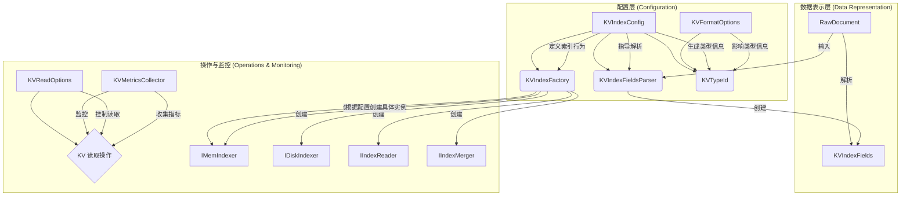

# Indexlib KV 存储核心：核心抽象与数据结构深度解析

**涉及文件:**
* `index/kv/KVCommonDefine.h`
* `index/kv/KVCommonDefine.cpp`
* `index/kv/KVFormatOptions.h`
* `index/kv/KVFormatOptions.cpp`
* `index/kv/KVReadOptions.h`
* `index/kv/KVTypeId.h`
* `index/kv/KVTypeId.cpp`
* `index/kv/KVTimestamp.h`
* `index/kv/KVTimestamp.cpp`
* `index/kv/KVIndexFactory.h`
* `index/kv/KVIndexFactory.cpp`
* `index/kv/KVIndexFields.h`
* `index/kv/KVIndexFields.cpp`
* `index/kv/KVIndexFieldsParser.h`
* `index/kv/KVIndexFieldsParser.cpp`
* `index/kv/KVMetricsCollector.h`

## 1. 引言

Indexlib 的 KV（键值）索引模块是其强大功能集的核心组成部分，为海量数据提供了高效的存储和检索能力。理解其底层设计，特别是核心抽象和数据结构，是掌握 Indexlib KV 存储机制的关键。本文档旨在深入剖析 Indexlib KV 模块的基础构建块，阐述其设计理念、关键实现以及它们如何协同工作，共同构筑起一个高性能、可扩展的 KV 存储系统。

我们将从最基础的数据定义开始，逐步探索格式选项、读写配置、类型系统，并最终深入到工厂模式、字段解析和性能监控等高级抽象。通过这次旅程，读者将能够清晰地理解 Indexlib KV 模块的“骨架”，为其后续深入学习索引构建、读取和合并等复杂流程打下坚实的基础。

## 2. 系统架构与设计理念

Indexlib KV 模块的架构设计遵循了**模块化、可配置和高性能**的核心原则。其设计理念可以概括为以下几点：

*   **抽象与实现分离**：通过定义清晰的接口（如 `IIndexFactory`, `IIndexFieldsParser`）和配置类（如 `KVFormatOptions`, `KVReadOptions`），将 KV 存储的核心功能（如索引的创建、读写、合并）与具体实现解耦。这使得系统具有良好的扩展性，可以轻松替换或增加新的实现（例如，支持新的哈希算法或压缩格式）。
*   **配置驱动**：系统的行为在很大程度上由配置驱动。`KVIndexConfig` 作为核心配置，决定了索引的几乎所有方面，从字段类型、哈希函数到是否启用 TTL。这种设计使得用户可以根据不同的业务场景灵活地调整 KV 存储的行为，而无需修改代码。
*   **性能优先**：性能是 KV 存储的生命线。从数据结构的设计（如 `KVTypeId` 的紧凑布局）到关键路径的实现（如 `KVIndexFieldsParser` 的高效解析），都体现了对性能的极致追求。通过引入性能监控工具 `KVMetricsCollector`，开发人员可以持续地对系统进行性能分析和优化。
*   **面向文档的存储**：尽管名为 KV 存储，但 Indexlib 的设计紧密围绕“文档（Document）”这一核心概念。`KVIndexFields` 和 `KVIndexFieldsParser` 的存在，清晰地表明了系统处理的是结构化的文档数据，而不仅仅是简单的键值对。这种设计使其能够与 Indexlib 的其他索引类型（如倒排索引）无缝集成。

### 2.1 核心组件关系图



上图展示了本文档所分析的核心抽象与数据结构之间的相互关系。`KVIndexConfig` 处于中心地位，驱动着工厂、解析器和类型系统的行为。`KVFormatOptions` 和 `KVReadOptions` 分别对索引格式和读取行为进行微调。数据从 `RawDocument` 流入，经过 `KVIndexFieldsParser` 转换为内部表示 `KVIndexFields`。而 `KVIndexFactory` 则根据配置，负责创建索引生命周期中各个阶段（内存、磁盘、读取、合并）所需的核心组件。最后，`KVMetricsCollector` 默默地记录着每一次操作的性能数据，为系统优化提供依据。

## 3. 关键数据结构与核心抽象

### 3.1. `KVTypeId`：索引的“基因身份证”

`KVTypeId` 是一个至关重要的结构体，它像一个“基因身份证”，唯一地标识了一个 KV 索引的物理和逻辑特性。这个结构体的设计紧凑而全面，包含了决定索引行为和存储格式的所有关键信息。它的存在使得在运行时可以快速确定如何处理一个特定的 KV 索引，而无需反复解析复杂的配置。

**设计动机**：

*   **高效决策**：在索引的构建、读取和合并过程中，需要频繁地根据索引的特性（如是否变长、是否压缩）来选择不同的代码路径。将这些特性固化在一个紧凑的 `KVTypeId` 结构中，可以极大地提高决策效率。
*   **类型安全**：通过 `KVTypeId`，系统可以在不同组件之间传递索引的元信息，确保所有部分对索引的理解是一致的，从而避免因类型不匹配而导致的错误。
*   **简化配置传递**：相比于在各个组件之间传递庞大而复杂的 `KVIndexConfig` 对象，传递一个轻量级的 `KVTypeId` 更加高效和简洁。

**核心实现**：

`KVTypeId` 的定义如下，它通过一系列布尔标志和枚举类型，精确地描述了 KV 索引的方方面面。

```cpp
// index/kv/KVTypeId.h

#pragma pack(push, 8)
struct KVTypeId {
    KVIndexType onlineIndexType = KVIndexType::KIT_UNKOWN;
    KVIndexType offlineIndexType = KVIndexType::KIT_UNKOWN;
    FieldType valueType = ft_unknown; // valid when single field
    bool isVarLen = false;
    bool hasTTL = false;
    bool fileCompress = false; // var len used only
    bool compactHashKey = false;
    bool shortOffset = false;
    bool useCompactBucket = false;
    size_t valueLen = 0;                               // valid when simple value
    CompressTypeFlag compressTypeFlag = ct_other;      // valid when simple value
    indexlib::config::CompressTypeOption compressType; // valid when simple value
    // ... 构造函数和比较操作 ...
};
#pragma pack(pop)
```

`#pragma pack(push, 8)` 指令确保了结构体按照 8 字节对齐，这有助于在某些体系结构上提高访问效率。

`MakeKVTypeId` 函数是创建 `KVTypeId` 实例的工厂函数。它接收 `KVIndexConfig` 和可选的 `KVFormatOptions` 作为输入，并从中提取信息，填充 `KVTypeId` 结构。

```cpp
// index/kv/KVTypeId.cpp

KVTypeId MakeKVTypeId(const indexlibv2::config::KVIndexConfig& indexConfig, const KVFormatOptions* kvOptions)
{
    KVTypeId typeId;
    typeId.hasTTL = indexConfig.TTLEnabled();
    const auto& valueConfig = indexConfig.GetValueConfig();
    const auto& indexPreference = indexConfig.GetIndexPreference();
    
    // ... 根据 valueConfig 和 indexPreference 判断 isVarLen, valueType 等 ...

    if (!typeId.isVarLen) {
        // ... 处理定长值的压缩类型 ...
    }

    // ... 解析哈希类型，确定 onlineIndexType 和 offlineIndexType ...
    auto indexType = ParseKVIndexType(indexPreference.GetHashDictParam().GetHashType());
    typeId.offlineIndexType = indexType;
    typeId.onlineIndexType = KVIndexType::KIT_DENSE_HASH; // 在线总是使用 dense hash

    typeId.fileCompress = indexPreference.GetValueParam().EnableFileCompress();
    typeId.compactHashKey = indexConfig.IsCompactHashKey();
    
    if (kvOptions != nullptr) {
        typeId.shortOffset = kvOptions->IsShortOffset();
    } else {
        typeId.shortOffset = typeId.isVarLen && indexPreference.GetHashDictParam().HasEnableShortenOffset();
    }

    return typeId;
}
```

这个函数是连接高层配置与底层实现的关键桥梁。它将用户在 `KVIndexConfig` 中定义的意图，转化为 `KVTypeId` 这一高效、明确的运行时指令。

### 3.2. `KVIndexFields` & `KVIndexFieldsParser`：从原始文档到内部表示

`KVIndexFields` 和 `KVIndexFieldsParser` 共同承担了将用户输入的原始文档（`RawDocument`）转换为 Indexlib KV 模块内部数据表示的职责。这个过程是数据进入索引系统的第一步，其效率和正确性至关重要。

*   **`KVIndexFieldsParser` (解析器)**：负责解析。它读取 `RawDocument`，根据 `KVIndexConfig` 的定义，提取出主键（PKey）、值（Value）、TTL、时间戳等信息。
*   **`KVIndexFields` (数据容器)**：负责存储解析结果。它是一个轻量级的数据结构，持有从文档中解析出的所有 KV 相关字段的视图（`autil::StringView`），并使用内存池（`autil::mem_pool::Pool`）进行高效的内存管理，避免了不必要的数据拷贝。

**设计动机**：

*   **解耦解析逻辑**：将解析逻辑封装在 `KVIndexFieldsParser` 中，使得解析过程与文档的具体来源（例如，实时数据流、离线批处理）和索引的内部实现解耦。
*   **高效内存使用**：`KVIndexFields` 通过使用 `StringView` 和内存池，最大限度地减少了数据处理过程中的内存开销。它只持有对原始数据的引用，直到数据被真正写入索引时才会进行序列化。
*   **支持多 KV 索引**：一个文档可能需要被写入多个 KV 索引。`KVIndexFields` 内部使用一个 `UnorderedMap` 来存储针对不同 KV 索引（通过 `indexNameHash` 区分）的字段信息，从而能够在一个 `KVIndexFields` 对象中表示对多个索引的更新。

**核心实现**：

`KVIndexFieldsParser` 的核心是 `Parse` 方法。它遍历所有已配置的 KV 索引，对每个索引调用 `ParseSingleField`。

```cpp
// index/kv/KVIndexFieldsParser.cpp

indexlib::util::PooledUniquePtr<document::IIndexFields>
KVIndexFieldsParser::Parse(const document::ExtendDocument& extendDoc, autil::mem_pool::Pool* pool,
                           bool& hasFormatError) const
{
    hasFormatError = false;
    auto kvIndexFields = indexlib::util::MakePooledUniquePtr<KVIndexFields>(pool, pool);
    auto rawDoc = extendDoc.GetRawDocument();
    auto opType = rawDoc->getDocOperateType();
    kvIndexFields->SetDocOperateType(opType);

    for (const auto& fieldResource : _fieldResources) {
        KVIndexFields::SingleField singleField;
        // 对每个 KV 索引进行独立解析
        auto r = ParseSingleField(fieldResource, rawDoc, pool, &singleField, &hasFormatError);
        if (!r) {
            AUTIL_LOG(ERROR, "parse kv index[%s] failed", fieldResource.kvConfig->GetIndexName().c_str());
            return nullptr;
        }
        // 将解析结果添加到 KVIndexFields 中
        r = kvIndexFields->AddSingleField(fieldResource.hash, singleField);
        assert(r);
    }
    return kvIndexFields;
}
```

`ParseSingleField` 内部会分别调用 `ParseKey` 和 `ParseValue`。`ParseKey` 使用 `KVKeyExtractor` 来计算主键的哈希值。`ParseValue` 则使用 `ValueConvertor` 来处理值字段，这可能涉及到复杂的类型转换和格式化。

```cpp
// index/kv/KVIndexFieldsParser.cpp

bool KVIndexFieldsParser::ParseKey(const FieldResource& fieldResource,
                                   const std::shared_ptr<document::RawDocument>& rawDoc, autil::mem_pool::Pool* pool,
                                   KVIndexFields::SingleField* singleField) const
{
    // ... 获取字段名和字段值 ...
    autil::StringView fieldName(kvConfig->GetFieldConfig()->GetFieldName());
    auto fieldValue = rawDoc->getField(fieldName);
    
    // ... 检查主键是否为空 ...

    // 使用内存池创建 StringView 的持久化拷贝
    singleField->pkFieldName = autil::MakeCString(fieldName, pool);
    singleField->pkFieldValue = autil::MakeCString(fieldValue, pool);

    uint64_t keyHash = 0;
    // 调用 keyExtractor 计算哈希
    fieldResource.keyExtractor->HashKey(fieldValue, keyHash);
    singleField->pkeyHash = keyHash;
    return true;
}
```

`KVIndexFields` 的核心数据结构是一个从索引名哈希到 `SingleField` 的映射。

```cpp
// index/kv/KVIndexFields.h

class KVIndexFields : public document::IIndexFields
{
public:
    struct SingleField {
        uint64_t pkeyHash = 0;
        // ... 其他字段：skeyHash, value, ttl, userTimestamp ...
        autil::StringView pkFieldValue; // 用于调试和日志
    };
private:
    // 使用内存池优化的 UnorderedMap
    indexlib::util::PooledUnorderedMap<uint64_t, SingleField> _fields;
    DocOperateType _opType = ADD_DOC;
};
```

这种设计清晰地分离了“做什么”（`KVIndexFields` 存储目标状态）和“怎么做”（`KVIndexFieldsParser` 执行解析），是 Indexlib 模块化设计思想的典范。

### 3.3. `KVIndexFactory`：索引生命周期的“总设计师”

`KVIndexFactory` 是实现 Indexlib 工厂模式的核心。它像一个“总设计师”，负责根据 `KVIndexConfig` 创建 KV 索引在整个生命周期中所需的各种核心组件，包括：

*   `IMemIndexer`：内存索引器，用于处理实时写入的数据。
*   `IDiskIndexer`：磁盘索引器，用于将内存中的索引转储（Dump）到磁盘。
*   `IIndexReader`：索引读取器，用于提供对 KV 数据的查询接口。
*   `IIndexMerger`：索引合并器，用于将多个磁盘上的索引段（Segment）合并成一个更大的段，以优化查询性能和空间利用率。

**设计动机**：

*   **统一创建入口**：将所有与 KV 索引相关的组件创建逻辑集中到一个工厂类中，简化了上层代码的实现，并确保了创建过程的一致性。
*   **支持异构实现**：KV 索引有多种实现方式（例如，定长值 vs. 变长值，不同的哈希算法）。`KVIndexFactory` 可以根据 `KVIndexConfig`（通过 `KVTypeId`）来判断应该创建哪种具体的实现类（如 `FixedLenKVMemIndexer` vs. `VarLenKVMemIndexer`），从而对上层代码屏蔽了这些实现细节。
*   **易于扩展**：当需要引入一种新的 KV 索引实现时，只需在 `KVIndexFactory` 中增加相应的创建逻辑，而无需修改使用这些组件的上层代码。

**核心实现**：

`KVIndexFactory` 的每个 `Create` 方法都遵循相似的模式：接收 `IIndexConfig`，将其动态转换为 `KVIndexConfig`，然后根据配置决定创建哪个具体的子类。

以 `CreateMemIndexer` 为例：

```cpp
// index/kv/KVIndexFactory.cpp

std::shared_ptr<IMemIndexer> KVIndexFactory::CreateMemIndexer(const std::shared_ptr<config::IIndexConfig>& indexConfig,
                                                              const MemIndexerParameter& indexerParam) const
{
    auto kvIndexConfig = std::dynamic_pointer_cast<indexlibv2::config::KVIndexConfig>(indexConfig);
    if (!kvIndexConfig) {
        // ... 错误处理 ...
        return nullptr;
    }

    // ... 计算最大可用内存 ...

    // 使用 MakeKVTypeId 来获取索引的类型信息
    auto typeId = MakeKVTypeId(*kvIndexConfig, nullptr);
    if (typeId.isVarLen) {
        // 如果是变长值，创建 VarLenKVMemIndexer
        return CreateVarLenKVMemIndexer(kvIndexConfig, indexerParam);
    } else {
        // 如果是定长值，创建 FixedLenKVMemIndexer
        return std::make_shared<FixedLenKVMemIndexer>(indexerParam.isTolerateDocError, maxBuildMemoryUse);
    }
}
```

`CreateVarLenKVMemIndexer` 方法进一步展示了工厂如何根据历史统计信息（`lastSegmentMetrics`）来优化新索引的参数，例如内存分配比例和压缩率。

```cpp
// index/kv/KVIndexFactory.cpp

std::shared_ptr<IMemIndexer>
KVIndexFactory::CreateVarLenKVMemIndexer(const std::shared_ptr<indexlibv2::config::KVIndexConfig>& indexConfig,
                                         const MemIndexerParameter& indexerParam) const
{
    float keyValueMemRatio = VarLenKVMemIndexer::DEFAULT_KEY_VALUE_MEM_RATIO;
    float valueCompressRatio = VarLenKVMemIndexer::DEFAULT_VALUE_COMPRESSION_RATIO;
    
    // 如果有历史段的统计信息，则加载并用于指导新 MemIndexer 的创建
    if (indexerParam.lastSegmentMetrics != nullptr) {
        SegmentStatistics stat;
        if (stat.Load(indexerParam.lastSegmentMetrics, indexConfig->GetIndexName())) {
            keyValueMemRatio = stat.keyValueSizeRatio;
            // ... 对比率进行范围限制 ...
            valueCompressRatio = stat.valueCompressRatio;
        }
    }

    return std::make_shared<VarLenKVMemIndexer>(indexerParam.isTolerateDocError, GetMaxBuildMemoryUse(indexerParam),
                                                keyValueMemRatio, valueCompressRatio, indexerParam.sortDescriptions,
                                                indexerParam.indexMemoryReclaimer);
}
```

`KVIndexFactory` 的设计体现了良好的面向对象编程实践，通过依赖倒置（上层依赖于 `IIndexFactory` 接口）和工厂模式，构建了一个灵活、可维护且易于扩展的索引组件创建体系。

### 3.4. `KVMetricsCollector`：性能的“脉搏监测仪”

在高性能存储系统中，对关键操作的性能进行精确度量是持续优化的前提。`KVMetricsCollector` 就是 Indexlib KV 模块的“脉搏监测仪”，它是一个专门用于收集和聚合 KV 查询过程中各项性能指标的工具类。

**设计动机**：

*   **精细化性能分析**：一个 KV 查询可能涉及到多个阶段，如查找缓存、查询内存表（MemTable）、查询磁盘表（SSTable）。`KVMetricsCollector` 能够分别记录在每个阶段的耗时和命中情况，从而帮助开发者精确定位性能瓶颈。
*   **低侵入性**：`KVMetricsCollector` 被设计成一个轻量级的对象，可以通过 `KVReadOptions` 按需传递给查询接口。当不需要性能分析时，传入一个 `nullptr` 即可，对主查询流程的性能影响极小。
*   **聚合与报告**：它不仅记录单次查询的指标，还支持通过 `operator+=` 进行累加，方便对一批查询的性能指标进行聚合统计。

**核心实现**：

`KVMetricsCollector` 内部维护了一系列计数器，用于记录不同维度的性能数据。

```cpp
// index/kv/KVMetricsCollector.h

class KVMetricsCollector
{
private:
    // 查询耗时 (us)
    int64_t _prepareLatency = 0;
    int64_t _memTableLatency = 0;
    int64_t _sstTableLatency = 0;

    // 命中次数
    int64_t _memTableCount = 0;
    int64_t _sstTableCount = 0; // 包括缓存
    int64_t _searchCacheResultCount = 0;

    // 缓存相关计数器
    indexlib::util::SearchCacheCounter _searchCacheCounter;
    indexlib::util::BlockAccessCounter _blockCounter;
    
    // ... 其他 IO 相关指标 ...
};
```

为了精确地度量不同阶段的耗时，`KVMetricsCollector` 实现了一个简单的状态机来跟踪当前查询所处的阶段。

```cpp
// index/kv/KVMetricsCollector.h

private:
    enum State {
        PREPARE = 1,
        MEMTABLE = 2,
        SSTABLE = 3,
    };
    int64_t _begin = 0;
    State _state = PREPARE;

public:
    void BeginQuery() { /* ... */ }
    void BeginMemTableQuery() { /* ... */ }
    void BeginSSTableQuery() { /* ... */ }
    void EndQuery() { /* ... */ }
};
```

查询流程会像这样调用这些方法：

1.  `BeginQuery()`：在查询开始时调用，记录总起始时间，状态置为 `PREPARE`。
2.  `BeginMemTableQuery()`：在开始查询内存表之前调用，此时会计算并累加 `_prepareLatency`，然后状态切换到 `MEMTABLE`。
3.  `BeginSSTableQuery()`：在开始查询磁盘表之前调用，计算并累加 `_memTableLatency`，状态切换到 `SSTABLE`。
4.  `EndQuery()`：查询结束时调用，根据当前状态计算最后一个阶段的耗时。

通过这种方式，`KVMetricsCollector` 将一次完整的查询耗时，清晰地分解到了准备、内存查找和磁盘查找三个阶段，为性能优化提供了宝贵的数据支持。

## 4. 技术风险与未来展望

尽管当前的设计已经相当成熟和健壮，但在未来的发展中仍可能面临一些技术挑战：

*   **配置复杂性**：随着支持的特性越来越多，`KVIndexConfig` 可能会变得越来越复杂，给用户带来较高的学习成本。未来可能需要提供更智能的默认配置或配置向导来简化这一过程。
*   **类型系统扩展**：目前 `KVTypeId` 的设计是静态的。如果未来需要支持更动态的类型（例如，在运行时添加新的压缩算法），可能需要对类型系统进行重构，使其更具可扩展性。
*   **性能监控粒度**：`KVMetricsCollector` 目前的监控粒度主要在表级别（MemTable vs. SSTable）。在更复杂的场景下，可能需要更细粒度的监控，例如，监控到具体某个磁盘文件或某个缓存块的访问情况。

## 5. 结论

本文档深入分析了 Indexlib KV 模块的核心抽象与数据结构，包括 `KVTypeId`、`KVIndexFields`、`KVIndexFieldsParser`、`KVIndexFactory` 和 `KVMetricsCollector` 等。这些组件共同构成了 Indexlib KV 存储的基石，它们的设计充分体现了模块化、可配置和高性能的原则。

通过理解这些基础构建块的设计理念和核心实现，我们可以更好地掌握 Indexlib KV 的工作原理，为后续深入学习其索引构建、读取、合并等高级功能，以及进行二次开发和性能优化打下坚实的基础。这些精心设计的抽象不仅保证了 Indexlib KV 模块当前的强大功能和高性能，也为其未来的发展和演进预留了充足的空间。
