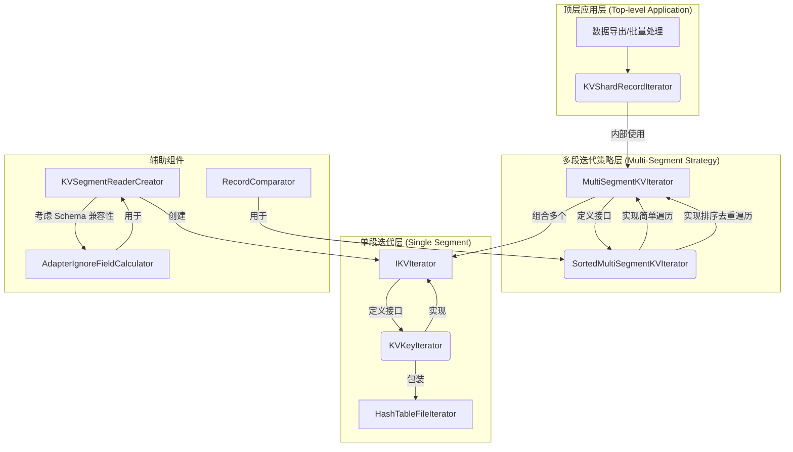

# Indexlib KV 存储核心：数据迭代器机制深度解析

**涉及文件:**
* `index/kv/IKVIterator.h`
* `index/kv/KVKeyIterator.h`
* `index/kv/KVKeyIterator.cpp`
* `index/kv/KVShardRecordIterator.h`
* `index/kv/KVShardRecordIterator.cpp`
* `index/kv/MultiSegmentKVIterator.h`
* `index/kv/MultiSegmentKVIterator.cpp`
* `index/kv/SimpleMultiSegmentKVIterator.h`
* `index/kv/SimpleMultiSegmentKVIterator.cpp`
* `index/kv/SortedMultiSegmentKVIterator.h`
* `index/kv/SortedMultiSegmentKVIterator.cpp`

## 1. 引言

除了通过键进行快速点查，对整个数据集进行全量扫描或遍历也是许多数据处理和分析场景（如数据导出、批量计算、索引合并）的刚需。Indexlib KV 模块为此提供了一套强大而灵活的迭代器（Iterator）机制。这套机制不仅能够遍历单个索引段（Segment）的数据，更核心的是，它能够以不同的策略（简单拼接、排序去重）将多个段的数据流聚合成一个统一的、对上层透明的视图。

本文档旨在深入剖析 Indexlib KV 的数据迭代器体系。我们将从最基础的 `IKVIterator` 接口开始，逐步探索其在单个段内的实现 `KVKeyIterator`，然后重点分析用于处理跨段遍历的 `MultiSegmentKVIterator` 及其两个关键实现：`SimpleMultiSegmentKVIterator` 和 `SortedMultiSegmentKVIterator`。此外，我们还将探讨 `KVShardRecordIterator` 如何作为一个更上层的封装，为数据导出等任务提供面向分片（Shard）的遍历能力。通过本次分析，读者将能全面理解 Indexlib 是如何实现对海量 KV 数据的高效、有序遍历的。

## 2. 系统架构与设计理念

Indexlib KV 的迭代器架构遵循**组合优于继承、策略化、分层封装**的设计原则，构建了一个既可独立使用又可灵活组合的迭代器家族。

*   **组合优于继承 (Composition over Inheritance)**：系统的核心是 `IKVIterator` 接口，它定义了遍历单个数据源（如一个段的哈希表文件）的基本操作。更复杂的迭代器，如 `MultiSegmentKVIterator`，并不是通过继承 `IKVIterator` 来实现的，而是通过在内部持有和管理多个 `IKVIterator` 实例来构建更高级的功能。这种组合模式使得系统结构更加灵活，易于扩展。

*   **策略化 (Strategy Pattern)**：对于跨段遍历这一核心需求，Indexlib 提供了不同的策略实现。`SimpleMultiSegmentKVIterator` 提供了最简单的策略，即按段的顺序逐个遍历，不进行数据去重。而 `SortedMultiSegmentKVIterator` 则实现了复杂的排序和去重逻辑，能够提供一个全局有序且唯一的记录流。这种策略化的设计允许用户根据具体需求（是否需要去重、是否需要排序）选择最合适的迭代器，以在功能和性能之间取得平衡。

*   **分层封装 (Layered Encapsulation)**：迭代器体系层次分明。底层是 `KVKeyIterator`，直接与哈希表文件交互。中层是 `MultiSegmentKVIterator`，负责协调多个 `KVKeyIterator`。上层则是 `KVShardRecordIterator`，它封装了更复杂的逻辑，如处理 Schema 兼容性、过滤 TTL 过期数据、恢复原始主键（Raw Key）等，为特定的业务场景（如数据导出）提供了“开箱即用”的解决方案。

### 2.1 核心组件关系图



上图展示了迭代器家族的层次结构和协作关系。`KVKeyIterator` 是最基础的构建块，它实现了 `IKVIterator` 接口，负责遍历单个段。`MultiSegmentKVIterator` 作为抽象基类，定义了跨段迭代的框架，其子类 `SimpleMultiSegmentKVIterator` 和 `SortedMultiSegmentKVIterator` 提供了不同的遍历策略。这些中层迭代器通过 `KVSegmentReaderCreator` 来创建底层的 `IKVIterator` 实例，并在此过程中处理 Schema 兼容性问题。最高层的 `KVShardRecordIterator` 则进一步封装了这些功能，提供了面向分片的、带有数据过滤和恢复能力的完整遍历服务。

## 3. 关键组件深度解析

### 3.1. `IKVIterator` & `KVKeyIterator`：单段遍历的基石

`IKVIterator` 是所有单段迭代器的统一抽象，定义了 `HasNext`、`Next`、`Seek` 等核心接口。`KVKeyIterator` 是其主要实现，负责遍历单个段中的 `kv_key` 文件（即哈希表文件）。

**设计动机**：

*   **统一接口**：为上层组件提供一个统一的、与具体哈希表实现无关的遍历接口。
*   **封装底层细节**：`KVKeyIterator` 内部包装了一个 `HashTableFileIterator`，将直接与哈希表二进制文件格式打交道的复杂逻辑封装起来。
*   **支持排序**：`KVKeyIterator` 提供了 `SortByKey` 和 `SortByValue` 方法，允许在遍历前对数据进行排序。这对于实现全局有序的 `SortedMultiSegmentKVIterator` 至关重要。

**核心实现**：

`KVKeyIterator` 的构造函数接收一个 `HashTableFileIterator` 和一个 `ValueUnpacker`。

```cpp
// index/kv/KVKeyIterator.cpp

KVKeyIterator::KVKeyIterator(std::unique_ptr<HashTableFileIterator> hashIter, ValueUnpacker* valueUnpacker,
                             bool isVarLen)
    : _hashIter(std::move(hashIter))
    , _valueUnpacker(valueUnpacker)
    , _isVarLen(isVarLen)
{}
```

`Next` 方法是其核心。它从 `_hashIter` 获取原始的键和打包后的值，然后使用 `_valueUnpacker` 将值解包，填充到 `Record` 结构中。

```cpp
// index/kv/KVKeyIterator.cpp

Status KVKeyIterator::Next(autil::mem_pool::Pool* pool, Record& record)
{
    record.key = _hashIter->GetKey();
    record.deleted = _hashIter->IsDeleted();

    auto value = _hashIter->GetValue();
    // 使用 valueUnpacker 解析出 timestamp 和真正的 value
    _valueUnpacker->Unpack(value, record.timestamp, record.value);
    
    // ... 对定长场景的特殊处理，需要拷贝 value ...

    try {
        _hashIter->MoveToNext();
    } catch (const std::exception& e) {
        return Status::IOError(e.what());
    }
    return Status::OK();
}
```

### 3.2. `SimpleMultiSegmentKVIterator`：简单高效的跨段拼接

这是最基础的跨段迭代器。它的策略非常简单：按照段列表的顺序，依次遍历完一个段，再遍历下一个段，直到所有段都遍历完毕。

**设计动机**：

*   **低开销**：这种简单的拼接方式几乎没有额外的计算和内存开销，适用于不需要去重和排序的场景，例如对所有数据进行一次性的批量处理。
*   **实现简单**：逻辑清晰，易于实现和维护。

**核心实现**：

`SimpleMultiSegmentKVIterator` 内部维护一个当前段的索引 `_currentIndex` 和一个当前段的迭代器 `_curIter`。

```cpp
// index/kv/SimpleMultiSegmentKVIterator.h

class SimpleMultiSegmentKVIterator final : public MultiSegmentKVIterator
{
    // ...
private:
    std::unique_ptr<IKVIterator> _curIter;
    int32_t _currentIndex;
};
```

`Next` 方法的逻辑非常直观：如果当前迭代器 (`_curIter`) 还有数据，就直接调用其 `Next` 方法。如果没有了，就调用 `MoveToSegment` 切换到下一个段的迭代器，然后继续。

```cpp
// index/kv/SimpleMultiSegmentKVIterator.cpp

Status SimpleMultiSegmentKVIterator::Next(autil::mem_pool::Pool* pool, Record& record)
{
    while (true) {
        if (_curIter && _curIter->HasNext()) {
            return _curIter->Next(pool, record);
        } else {
            // 当前迭代器已耗尽，移动到下一个
            auto s = MoveToSegment(_currentIndex + 1);
            if (!s.IsOK()) {
                return s; // 如果没有更多段了，会返回 Eof
            }
        }
    }
}
```

`MoveToSegment` 方法通过基类 `MultiSegmentKVIterator` 提供的 `CreateIterator` 来创建指定段的 `IKVIterator` 实例。

### 3.3. `SortedMultiSegmentKVIterator`：复杂的排序去重遍历

`SortedMultiSegmentKVIterator` 是迭代器家族中技术最复杂的成员。它旨在提供一个全局有序（按值排序）且键唯一的数据流。这在需要生成全局有序快照或进行数据合并的场景中至关重要。

**设计动机**：

*   **全局有序视图**：提供一个跨越所有段的、按值排序的统一数据视图。
*   **数据去重**：由于 Indexlib 的数据是按段增量写入的，同一个键可能在多个段中存在记录（通常以最新的为准）。该迭代器需要实现去重逻辑，只返回每个键的最新、最有效的记录。

**核心实现**：

其实现分为两个核心阶段：

**阶段一：收集被覆盖的旧键 (`CollectUnusedKeys`)**

由于数据是按段（Segment）更新的，新段（segmentId 大）的数据会覆盖旧段的数据。为了在后续的值排序中避免处理这些无效的旧记录，迭代器首先需要找出所有被新段覆盖的键。

1.  它将所有段的 `KVKeyIterator` 都切换到按键（Key）排序模式。
2.  使用一个最小堆（Min-Heap）对所有段的键进行多路归并。
3.  在归并过程中，如果发现当前弹出的键与上一个弹出的键相同，就意味着这是一个重复的键。由于段是按新旧顺序处理的，这个重复的键必然来自一个较旧的段，因此是无效的。它会将这个无效键的标识（`{key, segmentIndex}`）记录在一个 `_unusedKeys` 集合中。

```cpp
// index/kv/SortedMultiSegmentKVIterator.cpp

Status SortedMultiSegmentKVIterator::CollectUnusedKeys()
{
    // ... 初始化一个按 key 排序的最小堆 ...
    std::priority_queue<UnusedKey, std::vector<UnusedKey>, UnusedKeyCmp> heap;

    // ... 将所有段的第一个 key 放入堆中 ...

    std::optional<keytype_t> lastKey;
    while (!heap.empty()) {
        const auto& item = heap.top();
        keytype_t key = item.first;
        uint32_t segmentIndex = item.second;
        // 如果当前 key 和上一个 key 相同，说明是重复键，记录到 _unusedKeys
        if (lastKey.has_value() && lastKey.value() == key) {
            _unusedKeys.emplace(std::move(item));
        }
        lastKey = key;
        heap.pop();
        // 将该 segment 的下一个 key 放入堆中
        auto s = PushNextKeyToHeap(segmentIndex);
        // ...
    }
    return Status::OK();
}
```

**阶段二：按值排序并过滤 (`InitValueHeap` & `Next`)**

1.  将所有段的 `KVKeyIterator` 切换到按值（Value）排序模式。
2.  初始化一个按值排序的最小堆 (`_valueHeap`)。
3.  从每个段中取出第一条记录，如果其键不在 `_unusedKeys` 集合中，则将其放入 `_valueHeap`。
4.  `Next` 方法的逻辑就是从 `_valueHeap` 中弹出堆顶元素（即全局最小值的记录），然后从该记录所属的段中补充下一条记录到堆中（同样需要检查是否为 unused key）。

```cpp
// index/kv/SortedMultiSegmentKVIterator.cpp

Status SortedMultiSegmentKVIterator::PushNextRecordToHeap(size_t segmentIndex)
{
    auto& iter = _iters[segmentIndex];
    // ...
    while (iter->HasNext()) {
        // ...
        auto s = iter->Next(pool, r);
        // ...
        // 检查该记录的 key 是否在之前收集的无效 key 集合中
        if (!_unusedKeys.empty() && _unusedKeys.count({r.key, segmentIndex}) > 0) {
            continue; // 如果是，则跳过，处理下一条
        }
        _valueHeap->emplace(std::move(r), segmentIndex);
        return Status::OK();
    }
    return Status::Eof();
}
```

通过这两个阶段的精巧设计，`SortedMultiSegmentKVIterator` 成功地实现了在保持全局值序的同时，清除了所有陈旧的、被覆盖的数据。

### 3.4. `KVShardRecordIterator`：面向分片的全功能遍历器

`KVShardRecordIterator` 是一个更高层次的封装，它直接面向分片（Shard）级别的数据遍历任务。它不仅处理多段聚合，还集成了 TTL 过滤、Schema 适配、原始主键恢复等复杂功能。

**核心实现**：

*   **迭代器管理**：内部持有多个 `KVIteratorWrapper`，每个 wrapper 包含了一个段的 `IKVIterator`，以及用于去重的 `pkHashTable` 和用于恢复原始主键的 `pkValueReader`。
*   **去重逻辑**：在 `Next` 方法中，对于从当前段 `_currIteratorIndex` 迭代出的记录，它会反向查询所有更新的段（`id < _currIteratorIndex`）的 `pkHashTable`，检查该键是否存在。如果存在，说明该记录已被更新的段覆盖，应跳过。
*   **过滤**：通过 `_recordFilter`（可以是 `TTLFilter` 或 `NoneFilter`）对记录进行过滤，剔除已过期的数据。
*   **原始主键恢复**：通过 `AddRawKey` 方法，使用 `pkValueReader` 读取专门存储原始主键的 KV 索引，将 `keytype_t` 类型的哈希键恢复为用户可读的字符串形式。

## 4. 技术风险与未来展望

*   **内存消耗**：`SortedMultiSegmentKVIterator` 需要在内存中维护 `_unusedKeys` 集合和 `_valueHeap`，在段数量和键数量巨大时，可能会消耗大量内存。特别是 `_unusedKeys` 使用 `std::set`，内存效率不高。注释中也提到了可以优化为更高效的哈希表。
*   **性能开销**：排序和去重逻辑，特别是 `SortedMultiSegmentKVIterator` 的两阶段处理，会带来显著的 CPU 开销。对于超大规模数据集，全量排序可能变得不可行。可以探索基于分桶或分区的近似排序算法。
*   **迭代器组合的复杂性**：虽然组合模式很灵活，但当迭代器嵌套层次很深时（如 `KVShardRecordIterator` -> `SortedMultiSegmentKVIterator` -> `AdapterKVIterator` -> `KVKeyIterator`），理解数据流和调试问题会变得困难。

## 5. 结论

Indexlib KV 的数据迭代器体系是一个功能丰富且设计精巧的系统。它通过分层和策略化的设计，提供了从简单的单段遍历到复杂的跨段排序去重等多种遍历能力。`SimpleMultiSegmentKVIterator` 提供了低开销的快速遍历，而 `SortedMultiSegmentKVIterator` 通过巧妙的两阶段堆排序算法，解决了全局有序和数据去重这一核心难题。更高层的 `KVShardRecordIterator` 则进一步封装了业务逻辑，提供了面向应用的完整解决方案。

理解这套迭代器机制，不仅能帮助我们选择合适的工具来完成数据批量处理任务，也为我们设计自己的复杂数据流处理系统提供了优秀的范例和深刻的启示。
