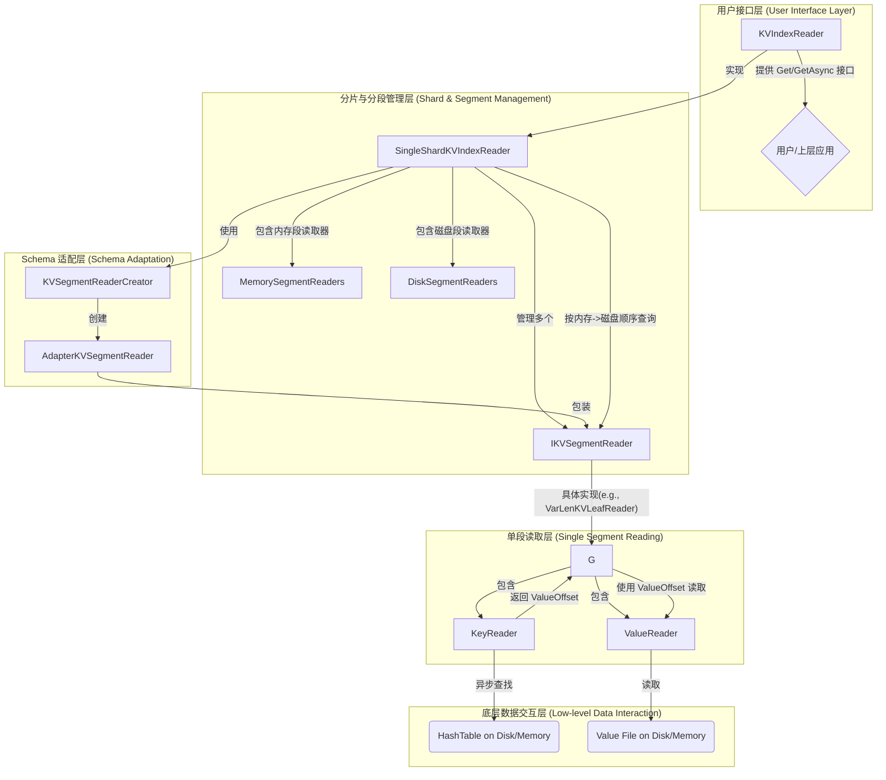

# Indexlib KV 存储核心：索引读取与查询机制深度解析

**涉及文件:**
* `index/kv/IKVSegmentReader.h`
* `index/kv/KVIndexReader.h`
* `index/kv/KVIndexReader.cpp`
* `index/kv/KVSegmentReaderCreator.h`
* `index/kv/KVSegmentReaderCreator.cpp`
* `index/kv/SingleShardKVIndexReader.h`
* `index/kv/SingleShardKVIndexReader.cpp`
* `index/kv/KeyReader.h`
* `index/kv/KeyReader.cpp`

## 1. 引言

高效的读取与查询是任何 KV 存储系统的核心价值所在。在 Indexlib 中，查询机制被设计为一套分层、异步且高度可扩展的架构，能够同时处理来自内存（实时数据）和磁盘（持久化数据）的请求，并最终将结果聚合返回给用户。本文档旨在深入剖析 Indexlib KV 模块的读取与查询体系，揭示其如何从一个顶层的查询请求开始，逐层深入，最终定位到具体的数据存储位置并返回结果。

我们将从顶层的 `KVIndexReader` 接口出发，探索其实现 `SingleShardKVIndexReader` 如何协调和管理多个索引段（Segment）的查询。接着，我们将深入到单个段的读取核心 `IKVSegmentReader` 及其关键组成部分 `KeyReader`，理解它们如何与磁盘或内存中的数据结构进行交互。最后，我们还会分析 `KVSegmentReaderCreator` 如何在多版本 Schema 兼容性方面发挥关键作用。通过这次探索，读者将能全面理解 Indexlib KV 查询路径的完整图景。

## 2. 系统架构与设计理念

Indexlib KV 的读取查询架构围绕**分层抽象、异步化、Schema 兼容性**三大核心理念构建，旨在提供一个高性能、非阻塞且适应业务变化的查询引擎。

*   **分层抽象 (Layered Abstraction)**：查询体系结构层次分明。顶层的 `KVIndexReader` 负责面向用户的接口，它将一个查询请求分发到一个或多个分片（Shard）的 `SingleShardKVIndexReader`。`SingleShardKVIndexReader` 则管理着该分片内所有段（Segment）的 `IKVSegmentReader`，并按照“实时优先”（内存段 -> 磁盘段）的顺序进行查询。`IKVSegmentReader` 最终通过 `KeyReader` 和 `ValueReader`（未在本次分析文件中，但功能可推断）与底层数据结构交互。这种分层设计使得每一层都只关注自己的职责，降低了系统的复杂度。

*   **异步化 (Asynchronization)**：为了最大化系统吞吐量和响应能力，Indexlib 大量采用了基于 `future-lite` 的协程（Coroutine）技术。从 `KVIndexReader` 的 `GetAsync` 接口到底层 `KeyReader` 的 `Find` 方法，整个查询链路都是异步的。这意味着在等待磁盘 I/O 等耗时操作时，执行线程可以被释放去处理其他请求，从而极大地提高了系统的并发处理能力。同步接口（如 `Get`）仅仅是异步接口的简单封装。

*   **Schema 兼容性 (Schema Compatibility)**：在长期运行的在线服务中，业务的 Schema（数据结构定义）不可避免地会发生变更（如增删字段）。Indexlib 的查询架构通过 `KVSegmentReaderCreator` 和 `AdapterKVSegmentReader`（在 `KVSegmentReaderCreator.cpp` 中引用）等机制，实现了强大的向后兼容能力。当查询一个使用旧 Schema 创建的段时，系统能够动态地创建一个适配器（Adapter），在读取数据后将其转换为当前查询所期望的新 Schema 格式，从而对上层应用屏蔽了底层数据版本的差异。

### 2.1 核心组件关系图



上图描绘了 KV 读取查询的完整流程。请求从 `KVIndexReader` 进入，由 `SingleShardKVIndexReader` 接管。它会优先查询内存中的段（`MemorySegmentReaders`），如果未找到，则按顺序查询磁盘上的段（`DiskSegmentReaders`）。对于每个段，查询任务最终会落到具体的 `IKVSegmentReader` 实现上。该实现内部持有 `KeyReader` 和 `ValueReader`，`KeyReader` 负责在哈希表（`HashTable`）中异步查找键，获取值的偏移量；`ValueReader` 则根据偏移量读取最终的值。如果查询涉及的段与当前 Schema 不一致，`KVSegmentReaderCreator` 会介入，创建一个 `AdapterKVSegmentReader` 来动态转换数据格式。

## 3. 关键组件深度解析

### 3.1. `KVIndexReader` & `SingleShardKVIndexReader`：查询的入口与调度中心

`KVIndexReader` 是 Indexlib KV 查询功能的总入口，它定义了所有对外的查询接口。`SingleShardKVIndexReader` 是其核心实现，负责管理单个分片内的所有索引段，并调度对这些段的查询。

**设计动机**：

*   **统一接口**：`KVIndexReader` 提供了统一的同步 (`Get`) 和异步 (`GetAsync`) 接口，并支持按键（`StringView`）或键的哈希值（`keytype_t`）进行查询，方便不同场景下的使用。
*   **分层查询**：`SingleShardKVIndexReader` 将段分为内存段（`_memorySegmentReaders`）和磁盘段（`_diskSegmentReaders`），并严格按照“内存优先”的原则进行查询。这确保了最新的数据（在内存中）能够被最先命中，保证了数据的实时性。
*   **生命周期管理**：`DoOpen` 方法负责在 Reader 打开时，加载所有相关的段，并根据 Schema 差异创建必要的适配器，完成了从 `TabletData` 到可服务 `Reader` 的转换。

**核心实现**：

`SingleShardKVIndexReader` 的 `DoOpen` 方法是其初始化的核心。它遍历 `TabletData` 中的所有段，并调用 `LoadSegments`。

```cpp
// index/kv/SingleShardKVIndexReader.cpp

Status SingleShardKVIndexReader::DoOpen(const std::shared_ptr<indexlibv2::config::KVIndexConfig>& kvIndexConfig,
                                        const framework::TabletData* tabletData) noexcept
{
    // ...
    // 分别加载 BUILDING, DUMPING, BUILT 状态的段
    s = LoadSegments(kvIndexConfig, ignoreFieldCalculator, tabletData, framework::Segment::SegmentStatus::ST_BUILDING);
    // ...
    s = LoadSegments(kvIndexConfig, ignoreFieldCalculator, tabletData, framework::Segment::SegmentStatus::ST_BUILT);
    return s;
}
```

`LoadSlice` 模板方法是实际的加载逻辑。它根据段是内存段还是磁盘段，从 `Segment` 对象中获取 `Indexer`（`KVMemIndexerBase` 或 `KVDiskIndexer`），然后从中提取出 `IKVSegmentReader`。关键在于，如果段的 Schema ID 与 Reader 的 Schema ID 不匹配，它会调用 `KVSegmentReaderCreator` 来创建一个适配器。

```cpp
// index/kv/SingleShardKVIndexReader.h (template implementation in header)

template <typename Iterator, bool inMemory>
Status SingleShardKVIndexReader::LoadSlice(/* ... */)
{
    for (auto it = begin; it != end; it++) {
        // ... 获取 segment, indexer, segmentReader ...
        if (segSchemaId != _readerSchemaId) {
            // Schema 不匹配，创建适配器
            std::tie(s, segmentReader) = KVSegmentReaderCreator::CreateSegmentReader(
                segmentReader, segmentIndexConfig, indexConfig, ignoreFields, true);
            if (!s.IsOK()) return s;
        }
        if constexpr (inMemory) {
            _memorySegmentReaders.emplace_back(std::move(segmentReader));
        } else {
            _diskSegmentReaders.emplace_back(std::move(segmentReader));
            // ...
        }
    }
    return Status::OK();
}
```

查询的核心逻辑在 `DoGet` 方法中。它清晰地展示了查询的顺序：遍历 `_memorySegmentReaders`，然后遍历 `_diskSegmentReaders`，一旦命中（`status != NOT_FOUND`），就立刻返回结果。

```cpp
// index/kv/SingleShardKVIndexReader.h

inline FL_LAZY(KVResultStatus)
    SingleShardKVIndexReader::DoGet(/* ... */) const noexcept
{
    // ...
    // 1. 查询内存段
    for (const auto& reader : _memorySegmentReaders) {
        auto status =
            FL_COAWAIT GetFromSegmentReader(reader, key, value, ts, pool, metricsCollector, timeoutTerminator);
        if (status != KVResultStatus::NOT_FOUND) {
            FL_CORETURN status;
        }
    }
    // ...
    // 2. 查询磁盘段
    for (const auto& reader : _diskSegmentReaders) {
        auto status =
            FL_COAWAIT GetFromSegmentReader(reader, key, value, ts, pool, metricsCollector, timeoutTerminator);
        if (status != KVResultStatus::NOT_FOUND) {
            FL_CORETURN status;
        }
    }
    FL_CORETURN TranslateStatus(indexlib::util::NOT_FOUND);
}
```

### 3.2. `IKVSegmentReader` & `KeyReader`：单段查询的执行者

`IKVSegmentReader` 是对单个索引段（无论是内存还是磁盘）进行读取操作的抽象接口。而 `KeyReader` 是其关键的组成部分，专门负责从持久化的哈希表文件中读取数据。

**设计动机**：

*   **统一单段接口**：`IKVSegmentReader` 定义了统一的 `Get` 和 `CreateIterator` 接口，屏蔽了底层段是内存段还是磁盘段、是定长还是变长、是否压缩等实现细节。
*   **解耦键和值**：将键的查找逻辑封装在 `KeyReader` 中，使得 `IKVSegmentReader` 的具体实现（如 `VarLenKVLeafReader`）可以将更多的精力放在值的读取和处理上。
*   **异步 I/O**：`KeyReader` 的 `Find` 方法是异步的。对于非内存映射（`_inMemory == false`）的文件，它会通过 `_fsReader`（一个 `HashTableFileReaderBase` 实例）异步地从磁盘读取哈希表的桶链，这避免了在 I/O 等待期间阻塞线程。

**核心实现**：

`KeyReader` 的 `Open` 方法根据 `KVTypeId` 和文件是否被内存映射（`mmap`）来决定是创建 `_memoryReader`（直接在内存中查找）还是 `_fsReader`（从磁盘文件异步查找）。

```cpp
// index/kv/KeyReader.cpp

Status KeyReader::Open(/* ... */)
{
    // ...
    void* baseAddress = _keyFileReader->GetBaseAddress();
    _inMemory = (baseAddress != nullptr);

    std::unique_ptr<HashTableInfo> hashTableInfo;
    if (_typeId->isVarLen) {
        hashTableInfo = VarLenHashTableCreator::CreateHashTableForReader(*_typeId, !_inMemory);
    } else {
        hashTableInfo = FixedLenHashTableCreator::CreateHashTableForReader(*_typeId, !_inMemory);
    }

    _valueUnpacker = std::move(hashTableInfo->valueUnpacker);
    if (_inMemory) {
        _memoryReader = hashTableInfo->StealHashTable<HashTableBase>();
        // ... MountForRead ...
    } else {
        _fsReader = hashTableInfo->StealHashTable<HashTableFileReaderBase>();
        // ... Init ...
    }
    return Status::OK();
}
```

`Find` 方法是 `KeyReader` 的核心查询接口。它根据 `_inMemory` 标志选择不同的执行路径。

```cpp
// index/kv/KeyReader.h

inline FL_LAZY(indexlib::util::Status) KeyReader::Find(/* ... */) const
{
    autil::StringView tmpValue;
    indexlib::util::Status status;
    if (_inMemory) {
        // 内存模式：直接同步查找
        status = _memoryReader->Find(key, tmpValue);
    } else {
        // 磁盘模式：异步查找
        indexlib::util::BlockAccessCounter* blockCounter = collector ? collector->GetBlockCounter() : nullptr;
        status = FL_COAWAIT _fsReader->Find(key, tmpValue, blockCounter, pool, timeoutTerminator);
    }
    if (status == indexlib::util::NOT_FOUND) {
        FL_CORETURN status;
    }
    // ...
    // 解包，分离出 timestamp 和真正的 value (或 value offset)
    _valueUnpacker->Unpack(tmpValue, ts, value);
    FL_CORETURN status;
}
```

`_valueUnpacker` 在这里扮演了重要角色，它负责解析从哈希表中取出的紧凑数据，将其还原为时间戳和值的偏移量（对于变长）或值本身（对于定长）。

### 3.3. `KVSegmentReaderCreator`：Schema 演进的“翻译官”

`KVSegmentReaderCreator` 是处理不同版本 Schema 之间兼容性问题的关键。当一个索引的 Schema 发生变化后，新旧两种数据格式会同时存在于不同的段中。`KVSegmentReaderCreator` 能够在加载段时，动态地为旧段创建一个“适配器” `Reader`，使其能够以新 Schema 的格式返回数据。

**设计动机**：

*   **平滑升级**：允许业务在不停止服务、不重做全部数据的情况下，平滑地升级其数据 Schema。
*   **逻辑集中**：将 Schema 适配的复杂逻辑集中到 `KVSegmentReaderCreator` 和 `AdapterKVSegmentReader` 中，使得核心的查询逻辑（如 `SingleShardKVIndexReader`）无需关心 Schema 版本的差异。

**核心实现**：

`CreateSegmentReader` 是其核心静态方法。它接收一个原始的 `segReader`，以及该段的配置 `segmentIndexConfig` 和当前查询期望的配置 `readerIndexConfig`。

```cpp
// index/kv/KVSegmentReaderCreator.cpp

pair<Status, shared_ptr<IKVSegmentReader>> KVSegmentReaderCreator::CreateSegmentReader(
    /* ... */)
{
    auto currentConfig = segmentIndexConfig->GetValueConfig();
    auto targetConfig = readerIndexConfig->GetValueConfig();
    auto adapter = std::make_shared<PackValueAdapter>();
    // ... 创建并初始化 PackValueAdapter ...
    if (!adapter->Init(currentPackConfig, targetPackConfig, ignoreFields)) {
        // ...
    }
    // 如果不需要转换，直接返回原始 Reader
    if (!adapter->NeedConvert()) {
        return std::make_pair(Status::OK(), segReader);
    }

    // ... 检查是否支持转换 ...

    // 创建并返回一个包装了原始 Reader 和适配器逻辑的 AdapterKVSegmentReader
    return std::make_pair(Status::OK(),
                          std::make_shared<AdapterKVSegmentReader>(segReader, adapter, currentConfig, targetConfig));
}
```

`PackValueAdapter` 是实际执行数据转换的组件。它会比较新旧两个 `ValueConfig`，计算出字段的增、删、改情况，并在运行时对从旧段中读取出的二进制 `value` 进行重新解析和封装，生成符合新 `ValueConfig` 格式的数据。

## 4. 技术风险与未来展望

*   **查询延迟**：虽然系统是异步的，但在高 QPS 场景下，如果磁盘段数量过多，逐个查询仍然可能导致较高的尾部延迟。未来的优化可以探索更智能的查询路由，例如通过布隆过滤器（Bloom Filter）等数据结构快速跳过不包含目标键的段。
*   **适配器性能**：`AdapterKVSegmentReader` 在运行时进行数据转换会带来额外的 CPU 开销。对于 Schema 变化频繁或转换逻辑复杂的场景，这可能成为性能瓶颈。考虑在合并（Merge）过程中将旧数据彻底转换为新格式，是消除运行时开销的根本方法。
*   **内存占用**：对于全内存加载的 `KeyReader`，其内存占用与键的数量成正比。对于超大规模的 KV 存储，全内存加载所有键可能会消耗过多的内存。探索混合存储方案，如将热点键放在内存，冷数据放在磁盘，是未来的一个重要方向。

## 5. 结论

Indexlib KV 的读取与查询机制是一套设计精良、层次清晰且功能强大的系统。它通过 `KVIndexReader` 的分层调度、`KeyReader` 的异步 I/O 以及 `KVSegmentReaderCreator` 的动态适配能力，成功地构建了一个能够同时满足高性能、高并发和业务灵活性的查询引擎。

从顶层的异步接口到底层的哈希表文件读取，再到巧妙的 Schema 兼容处理，每一个环节都体现了对现代存储系统复杂需求的深刻理解。掌握这套机制，不仅能帮助我们高效地使用 Indexlib，也为我们设计其他复杂的分布式查询系统提供了宝贵的架构范例。
