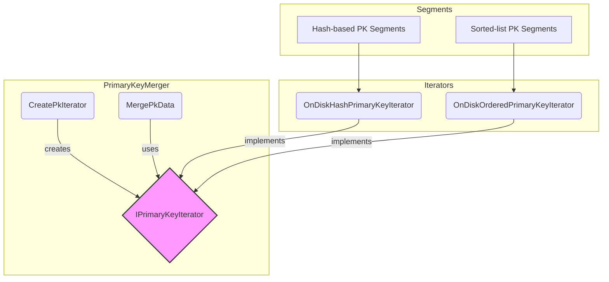

# Indexlib 主键迭代器 (`OnDiskHash...` & `OnDiskOrdered...`) 深度解析

**涉及文件:**
*   `index/primary_key/merger/OnDiskHashPrimaryKeyIterator.h`
*   `index/primary_key/merger/OnDiskOrderedPrimaryKeyIterator.h`

## 1. 引言：数据合并的源头活水

在 Indexlib 的主键合并流程中，`PrimaryKeyMerger` 扮演着运筹帷幄的“指挥官”角色。然而，任何指挥官都需要前线的“侦察兵”来提供情报。主键迭代器（Primary Key Iterator）正是这样的角色，它们是整个合并流程的数据源头，负责从磁盘上存储的、来自多个源数据段（Source Segments）的主键索引文件中，高效、有序地读取出每一对“主键（PK）-文档ID（docid）”数据。

Indexlib 支持两种主要的主键存储格式：**哈希表（Hash Table）** 和 **有序列表（Sorted List）**。这两种格式各有优势，分别适用于不同的查询场景。为了屏蔽底层存储的差异，`PrimaryKeyMerger` 并不直接读取磁盘文件，而是通过一个统一的 `IPrimaryKeyIterator` 接口来获取数据。本文档将深入剖析这个接口的两个核心实现：`OnDiskHashPrimaryKeyIterator` 和 `OnDiskOrderedPrimaryKeyIterator`。

我们将揭示这两种迭代器如何分别适配不同的磁盘布局，它们内部的核心算法（特别是 `OnDiskOrderedPrimaryKeyIterator` 的多路归并算法），以及这种基于接口的迭代器设计模式如何为 Indexlib 带来巨大的灵活性和可扩展性。理解了它们，就等于掌握了主键合并流程的“第一公里”。

---

## 2. 架构设计：多态与适配

迭代器设计的核心思想是 **“封装遍历，统一接口”**。`PrimaryKeyMerger` 通过一个工厂方法 `CreatePkIterator`，根据当前主键索引的配置（`pk_hash_table` 或 `pk_sorted_list`），动态地创建出正确的迭代器实例。这两种迭代器都实现了 `IPrimaryKeyIterator` 接口，从而使得上层合并逻辑可以完全不受底层存储格式的影响。

### 2.1 迭代器在合并流程中的位置



这个架构清晰地展示了：
*   **工厂与接口**: `PrimaryKeyMerger` 不直接依赖具体的迭代器实现，而是依赖于 `IPrimaryKeyIterator` 抽象接口。工厂方法 `CreatePkIterator` 负责决策并创建实例。
*   **适配不同存储**: `OnDiskHashPrimaryKeyIterator` 适配哈希存储的段，而 `OnDiskOrderedPrimaryKeyIterator` 适配有序存储的段。
*   **统一的消费方式**: `MergePkData` 逻辑只需通过 `HasNext()` 和 `Next()` 两个核心方法，就能从迭代器中不断获取 PK-docid 对，无论其来源是哈希表还是有序列表。

---

## 3. `OnDiskOrderedPrimaryKeyIterator`：优雅的多路归并

当主键索引采用有序列表方式存储时，每个数据段内部的 PK 是有序的。为了在合并后依然保持全局有序（或至少以一种有序的方式进行处理），需要将来自多个有序段的数据流，合并成一个单一的、全局有序的数据流。`OnDiskOrderedPrimaryKeyIterator` 正是为此而生，它采用了一种经典而高效的算法：**K路归并（K-Way Merge）**。

### 3.1 核心算法：基于最小堆的 K 路归并

该迭代器内部维护一个最小优先队列（Min-Priority Queue），在代码中体现为 `std::priority_queue`，并别名为 `Heap`。算法流程如下：
1.  **初始化**: 为每一个源数据段创建一个“叶子迭代器”（`PrimaryKeyLeafIterator`），这个叶子迭代器负责读取单个段文件。然后，将每个非空的叶子迭代器的第一个元素（PK-docid对）连同其迭代器指针和段的基准docid，一同放入最小堆中。
2.  **迭代**: 每次调用 `Next()` 方法时：
    a. 从最小堆的堆顶取出一个元素。由于是最小堆，这个元素一定是当前所有段中主键值最小的那个。
    b. 记录下这个元素作为本次 `Next()` 的返回值。
    c. 将刚刚取出元素所属的那个叶子迭代器向前推进一个位置。
    d. 如果该叶子迭代器还未结束，则将其新的当前元素再次压入最小堆中。
3.  **结束**: 当最小堆为空时，意味着所有段的数据都已被遍历完毕，迭代结束。

### 3.2 核心代码实现

```cpp
// index/primary_key/merger/OnDiskOrderedPrimaryKeyIterator.h

template <typename Key>
class OnDiskOrderedPrimaryKeyIterator : public IPrimaryKeyIterator<Key>
{
public:
    // ...
    class SegmentIteratorComp // 堆的比较器，决定了排序规则
    {
    public:
        bool operator()(const SegmentIteratorPair& lft, const SegmentIteratorPair& rht)
        {
            SegmentPKPairTyped leftPkPair;
            lft.first->GetCurrentPKPair(leftPkPair);

            SegmentPKPairTyped rightPkPair;
            rht.first->GetCurrentPKPair(rightPkPair);

            if (leftPkPair.key == rightPkPair.key) { // PK相同，按 baseDocid 排序
                assert(lft.second != rht.second);
                return lft.second > rht.second;
            }
            return leftPkPair.key > rightPkPair.key; // PK不同，按PK排序
        }
    };
    typedef std::priority_queue<SegmentIteratorPair, SegmentIteratorPairVec, SegmentIteratorComp> Heap;

    [[nodiscard]] bool Init(...) override
    {
        // ...
        for (const auto& segment : segments) {
            // ... 为每个 segment 创建 PrimaryKeyLeafIterator ...
            SegmentIteratorPtr iterator = PrimaryKeyDiskIndexer<Key>::CreatePrimaryKeyLeafIterator(...);
            if (iterator->HasNext()) {
                _heap.push(std::make_pair(iterator.get(), segment._baseDocId));
            }
            _iterators.push_back(std::move(iterator));
        }
        // ...
    }

    [[nodiscard]] bool Next(PKPairTyped& pkPair) override
    {
        // ...
        auto* segmentIter = _heap.top().first;  // 取出最小元素
        docid64_t baseDocId = _heap.top().second;
        _heap.pop();
        SegmentPKPairTyped segmentPkPair;
        segmentIter->Next(segmentPkPair); // 在叶子迭代器内部，这会更新其当前PK对
        _currentPKPair.key = segmentPkPair.key;
        _currentPKPair.docid = baseDocId + segmentPkPair.docid;
        if (segmentIter->HasNext()) { // 如果该段还有数据
            _heap.push(std::make_pair(segmentIter, baseDocId)); // 将新元素入堆
        }
        return true;
    }
private:
    Heap _heap;
    std::vector<SegmentIteratorPtr> _iterators;
    // ...
};
```

**关键实现细节**：
*   **`SegmentIteratorComp`**: 这是算法的核心。它定义了堆中元素的排序规则。首先比较主键 `key`，`key` 小的优先。如果 `key` 相同，则比较 `baseDocId`（段的起始docid），`baseDocId` 大的优先。这种设计在处理含有重复主键（数据更新导致）的场景时，可以确保来自较新段（`baseDocId` 更大）的数据被优先处理，是一种隐式的版本选择策略。
*   **`_heap`**: 存储的是 `(PrimaryKeyLeafIterator*, docid64_t)` 的 pair。`docid64_t` 是 `baseDocId`，用于计算全局 docid 和在比较器中打破平局。
*   **`_iterators`**: 持有所有叶子迭代器的所有权（`std::unique_ptr`），确保其生命周期。
*   **效率**: 该算法的效率非常高。如果有个 `K` 个段，总共有 `N` 个主键，初始化堆的时间复杂度是 `O(K)`，每次 `Next()` 操作（出堆和入堆）的时间复杂度是 `O(logK)`。因此，遍历所有主键的总时间复杂度是 `O(N * logK)`，这在段数量很多时依然表现出色。

---

## 4. `OnDiskHashPrimaryKeyIterator`：简洁的适配器

与有序迭代器相比，`OnDiskHashPrimaryKeyIterator` 的实现看起来非常简单。哈希表本身是无序的，因此合并时不需要也无法保证全局有序。它的主要目标是将多个独立的、基于哈希的段的遍历过程，组合成一个统一的遍历流。

### 4.1 核心代码实现

```cpp
// index/primary_key/merger/OnDiskHashPrimaryKeyIterator.h

template <typename Key>
class OnDiskHashPrimaryKeyIterator : public PrimaryKeyIterator<Key>
{
public:
    OnDiskHashPrimaryKeyIterator() {};
    ~OnDiskHashPrimaryKeyIterator() {};

protected:
    std::pair<std::unique_ptr<PrimaryKeyLeafIterator<Key>>, docid64_t>
    GenerateSubIteratorPair(const SegmentDataAdapter::SegmentDataType& segment,
                            std::unique_ptr<PrimaryKeyLeafIterator<Key>> leafIterator) const override
    {
        return std::make_pair(std::move(leafIterator), segment._baseDocId);
    }

private:
    AUTIL_LOG_DECLARE();
};
```

**实现分析**：
*   **继承 `PrimaryKeyIterator<Key>`**: 关键在于它继承了一个不同的基类 `PrimaryKeyIterator`（注意，不是 `IPrimaryKeyIterator`）。这个基类很可能已经实现了遍历多个段的通用逻辑（模板方法模式）。
*   **重写 `GenerateSubIteratorPair`**: 这个函数是基类留出的一个“定制点”。`OnDiskHashPrimaryKeyIterator` 的实现非常直接：它只是将传入的 `leafIterator` 和 `baseDocId` 包装成一个 `std::pair` 并返回。这表明，它将如何处理每个子迭代器的具体逻辑完全委托给了基类 `PrimaryKeyIterator`。基类会负责调用这个方法，获取所有子迭代器，然后依次遍历它们，从而形成一个逻辑上的“串联”数据流。
*   **简洁的设计**: 这种设计体现了良好的抽象。`PrimaryKeyIterator` 基类封装了“组合多个迭代器”的通用算法，而 `OnDiskHashPrimaryKeyIterator` 作为一个具体的适配器，只提供了最基本的信息（如何创建子迭代器），实现了关注点分离。

---

## 5. 设计动机与技术洞察

*   **策略模式的完美应用**: `PrimaryKeyMerger` 根据配置选择不同的迭代器策略（有序归并 vs. 哈希遍历），是策略模式的教科书式应用。这使得合并逻辑与数据读取策略完全解耦。

*   **性能与需求的平衡**: 提供了两种迭代器，反映了对不同业务需求的深刻理解。
    *   `OnDiskOrderedPrimaryKeyIterator` 适用于需要保持数据有序性的场景，其 `O(N * logK)` 的性能在有序合并任务中接近最优。
    *   `OnDiskHashPrimaryKeyIterator` 则简单直接，适用于哈希索引这种本身不保证顺序的场景，避免了不必要的排序开销。

*   **模板方法模式**: `OnDiskHashPrimaryKeyIterator` 和其基类 `PrimaryKeyIterator` 的关系，是模板方法模式的体现。基类定义了算法的骨架，而子类可以重写某些步骤以实现定制化，这是一种强大的代码复用技术。

## 6. 结论

`OnDiskOrderedPrimaryKeyIterator` 和 `OnDiskHashPrimaryKeyIterator` 是 Indexlib 主键合并功能中不可或缺的“数据触手”。它们作为适配器和策略，优雅地解决了从不同物理存储中读取数据这一核心问题。

`OnDiskOrderedPrimaryKeyIterator` 通过精巧的 K 路归并算法，为有序数据的合并提供了高效的解决方案。而 `OnDiskHashPrimaryKeyIterator` 则通过与基类协作，用极简的代码实现了对哈希数据的适配。

这两个类的设计充分展示了 Indexlib 在架构上的成熟度：通过接口、继承、设计模式的组合运用，将复杂的系统功能分解为一系列清晰、可维护、可扩展的模块。它们是连接上层逻辑与底层存储的坚实桥梁，是保证整个合并流程得以顺利进行的关键基石。
