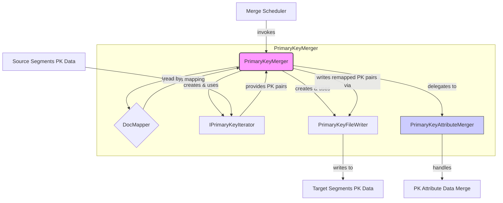

# Indexlib 主键合并核心引擎 (`PrimaryKeyMerger`) 深度解析

**涉及文件:** `index/primary_key/merger/PrimaryKeyMerger.h`

## 1. 引言：合并流程的指挥官

在 Indexlib 的世界里，数据段（Segment）的合并是维持索引性能和控制资源占用的核心机制。`PrimaryKeyMerger` 正是这个复杂流程中，专职负责主键（Primary Key, PK）索引合并的“指挥官”。它是一个精心设计的 C++ 模板类，位于主键合并功能的核心，负责协调各个组件，高效、有序地将多个源数据段中的主键数据迁移、整合到新的目标数据段中。

主键索引的核心使命是提供从主键到文档ID（docid）的快速映射。在合并过程中，文档的 docid 会发生变化，主键数据必须被精确地“重映射”（remap）到新的 docid 体系中。`PrimaryKeyMerger` 的设计目标正是为了精确、高效地完成这一使命。它不仅处理主键本身的数据，还负责调度其关联的属性数据（Attribute）的合并，确保数据的一致性和完整性。

本文档将深入 `PrimaryKeyMerger.h` 的内部，剖析其架构设计、核心算法、关键实现以及背后的设计动机。我们将通过解读其代码，理解它是如何与文档映射器（DocMapper）、主键迭代器（Iterator）、主键写入器（Writer）以及属性合并器（AttributeMerger）等关键模块协同工作的。通过本次分析，读者将能全面掌握 Indexlib 主键合并的顶层设计与核心工作流，为理解整个索引合并机制打下坚实的基础。

---

## 2. 架构设计：模块协同与责任分离

`PrimaryKeyMerger` 的设计完美体现了“高内聚、低耦合”的软件工程原则。它本身不处理具体的数据读写 I/O，而是作为一个协调者，定义了合并的“剧本”（即核心流程），并调用专职的“演员”（其他模块）来完成具体任务。

### 2.1 核心组件交互图



上图清晰地展示了 `PrimaryKeyMerger` 在合并生态中的核心地位：
1.  **被调用方**: 它实现了 `IIndexMerger` 接口，被上层的合并调度器（Merge Scheduler）统一调用。
2.  **核心依赖 `DocMapper`**: 它是合并逻辑的“导航仪”。`DocMapper` 封装了从旧的全局 docid 到新的目标段内 docid 的复杂映射关系。`PrimaryKeyMerger` 查询 `DocMapper` 来确定每个主键应该去往哪个新段、对应的新 docid 是什么。
3.  **数据读取 `IPrimaryKeyIterator`**: 它通过工厂方法 `CreatePkIterator` 创建合适的迭代器（`OnDiskHashPrimaryKeyIterator` 或 `OnDiskOrderedPrimaryKeyIterator`），从所有源数据段中按序读取 PK-docid 对。
4.  **数据写入 `PrimaryKeyFileWriter`**: 它为每个目标段创建一个写入器，负责将经过 `DocMapper` 重映射后的 PK-docid 对写入目标段的 PK 数据文件中。
5.  **责任委托 `PrimaryKeyAttributeMerger`**: 如果主键配置了需要存储属性（通常用于支持按主键查询），`PrimaryKeyMerger` 会将属性数据的合并任务完全委托给 `PrimaryKeyAttributeMerger` 处理，自身不关心属性合并的细节。

### 2.2 核心代码：`PrimaryKeyMerger` 类定义

```cpp
template <typename Key>
class PrimaryKeyMerger : public autil::NoCopyable, public index::IIndexMerger
{
public:
    PrimaryKeyMerger() {}
    ~PrimaryKeyMerger() {}

    Status Init(const std::shared_ptr<config::IIndexConfig>& indexConfig,
                const std::map<std::string, std::any>& params) override;

    Status Merge(const IIndexMerger::SegmentMergeInfos& segMergeInfos,
                 const std::shared_ptr<framework::IndexTaskResourceManager>& taskResourceManager) override;

private:
    Status DoMerge(const IIndexMerger::SegmentMergeInfos& segMergeInfos,
                   const std::shared_ptr<framework::IndexTaskResourceManager>& taskResourceManager);
    Status MergePkData(const std::shared_ptr<DocMapper>& docMapper,
                       const IIndexMerger::SegmentMergeInfos& segMergeInfos);
    std::shared_ptr<IPrimaryKeyIterator<Key>>
    CreatePkIterator(const std::shared_ptr<indexlibv2::index::PrimaryKeyIndexConfig>& pkConfig,
                     const IIndexMerger::SegmentMergeInfos& segMergeInfos);

private:
    std::shared_ptr<config::IIndexConfig> _indexConfig;
    indexlib::util::SimplePool _pool;
    std::string _docMapperName;
    std::shared_ptr<PrimaryKeyAttributeMerger<Key>> _pkAttributeMerger;

    AUTIL_LOG_DECLARE();
};
```

这段代码揭示了几个关键设计点：
*   **模板化 `template <typename Key>`**: 使 `PrimaryKeyMerger` 能够同时支持 `uint64_t` 和 `autil::uint128_t` 两种类型的主键，增强了通用性。
*   **接口实现 `public index::IIndexMerger`**: 表明其身份，融入 Indexlib 的合并框架。
*   **私有成员变量**: `_indexConfig` 存储主键的配置信息，`_pool` 用于内存管理，`_docMapperName` 记录要使用的 `DocMapper` 名称，`_pkAttributeMerger` 则是对属性合并器的持有。
*   **核心方法**: `Init` 用于初始化，`Merge` 是合并入口，`DoMerge` 是核心逻辑实现，`MergePkData` 专注于主键数据本身的合并，`CreatePkIterator` 则是创建迭代器的工厂方法。

---

## 3. 核心算法：主键数据的“乾坤大挪移”

`PrimaryKeyMerger` 的核心工作流在 `DoMerge` 和 `MergePkData` 方法中实现。这个过程可以被形象地比喻为一次数据的“乾坤大挪移”：将分散在各处（源数据段）的内力（PK数据），按照新的功法（`DocMapper`），重新汇聚凝练到新的丹田（目标数据段）中。

### 3.1 合并入口：`Merge` 与 `DoMerge`

`Merge` 方法是公开的接口，它简单地包裹了 `DoMerge`，并增加了一个 `try...catch` 块。这种设计是为了捕获所有预料之外的异常，防止单个索引的合并失败导致整个合并任务崩溃，增强了系统的鲁棒性。

`DoMerge` 的逻辑流程如下：
1.  **加载 `DocMapper`**: 根据 `Init` 阶段保存的 `_docMapperName`，从 `IndexTaskResourceManager` 中加载已经准备好的 `DocMapper` 实例。`DocMapper` 是整个合并操作的基础，它知道每一个旧文档的新去向。
2.  **合并主键数据**: 调用 `MergePkData` 方法，这是最核心的步骤，负责处理 `primary_key_data` 文件。
3.  **合并属性数据**: 如果 `_pkAttributeMerger` 存在（即配置了PK属性），则调用其 `Merge` 方法。这一步将主键值本身作为一种属性，写入到目标段的属性数据文件中。
4.  **清理资源**: 调用 `_pool.reset()` 释放内存池中所有为本次合并申请的内存。

### 3.2 核心实现：`MergePkData` 方法深度解析

`MergePkData` 是整个合并过程的“技术核心”，它精确地执行了主键数据的重映射和写入。

```cpp
template <typename Key>
Status PrimaryKeyMerger<Key>::MergePkData(const std::shared_ptr<DocMapper>& docMapper,
                                          const IIndexMerger::SegmentMergeInfos& segMergeInfos)
{
    AUTIL_LOG(INFO, "merge primary key data begin");
    std::shared_ptr<indexlibv2::index::PrimaryKeyIndexConfig> pkConfig =
        std::dynamic_pointer_cast<indexlibv2::index::PrimaryKeyIndexConfig>(_indexConfig);

    // 1. 创建统一的迭代器，从所有源数据段读取PK
    auto pkIter = CreatePkIterator(pkConfig, segMergeInfos);
    if (pkIter == nullptr) {
        return Status::Corruption("create pk iterator failed.");
    }
    std::map<segmentid_t, std::shared_ptr<PrimaryKeyFileWriter<Key>>> segIdToWriter;

    // ... 省略 indexFactory 和 indexDirPath 的创建 ...

    // 2. 为每个目标段准备一个写入器
    for (const auto& segMeta : segMergeInfos.targetSegments) {
        // ... 省略目录创建和清理的逻辑 ...
        std::shared_ptr<indexlib::file_system::FileWriter> fileWriter;
        std::tie(status, fileWriter) =
            pkDirectory->CreateFileWriter(PRIMARY_KEY_DATA_FILE_NAME, ...).StatusWith();
        // ...
        auto primaryKeyFileWriter = PrimaryKeyFileWriterCreator<Key>::CreatePKFileWriter(pkConfig);
        auto docCount = docMapper->GetTargetSegmentDocCount(segMeta->segmentId);
        primaryKeyFileWriter->Init(docCount, docCount, fileWriter, &_pool);
        segIdToWriter[segMeta->segmentId] = primaryKeyFileWriter;
    }

    typename PrimaryKeyIterator<Key>::PKPairTyped pkPair;
    // 3. 循环处理每一个PK-docid对
    while (pkIter->HasNext()) {
        pkIter->Next(pkPair);
        // 4. 查询DocMapper获取新的位置
        auto [segmentId, localDocId] = docMapper->Map(pkPair.docid);
        if (localDocId == INVALID_DOCID) {
            continue; // 文档被删除，无需合并
        }
        auto iter = segIdToWriter.find(segmentId);
        // ...
        auto fileWriter = iter->second;
        Status status;
        // 5. 根据PK类型（哈希或有序）写入数据
        if (pkConfig->GetPrimaryKeyIndexType() == pk_hash_table) {
            status = fileWriter->AddPKPair(pkPair.key, localDocId);
        } else {
            status = fileWriter->AddSortedPKPair(pkPair.key, localDocId);
        }
        // ...
    }
    // 6. 关闭所有写入器，完成文件写入
    for (const auto& iter : segIdToWriter) {
        iter.second->Close();
    }
    AUTIL_LOG(INFO, "merge primary key data end");
    return Status::OK();
}
```

**算法步骤详解:**
1.  **创建迭代器 (`CreatePkIterator`)**: 这是一个工厂方法。它会检查主键索引的类型（哈希表 `pk_hash_table` 还是有序列表），然后实例化并返回一个对应的迭代器 (`OnDiskHashPrimaryKeyIterator` 或 `OnDiskOrderedPrimaryKeyIterator`)。这个迭代器封装了从多个源数据段读取并统一视图的逻辑，使得上层代码可以像遍历一个集合一样遍历所有主键。
2.  **准备写入器**: 遍历所有**目标**数据段，为每一个段创建一个 `PrimaryKeyFileWriter`。这个写入器知道如何根据主键类型将数据写入到目标段的 `primary_key_data` 文件中。所有创建的写入器都存储在 `segIdToWriter` 这个 map 中，方便后续根据 `segmentId` 快速查找。
3.  **主循环**: `while (pkIter->HasNext())` 是合并的核心循环。迭代器 `pkIter` 会依次返回每一个源数据段中的 PK-docid 对。
4.  **文档重映射**: `docMapper->Map(pkPair.docid)` 是整个算法的“灵魂”。它根据旧的全局 docid (`pkPair.docid`)，计算出这个文档在合并后的新位置，即新的目标段ID (`segmentId`) 和段内 docid (`localDocId`)。如果文档在合并过程中被删除，`Map` 方法会返回 `INVALID_DOCID`，该主键记录就会被自然地丢弃。
5.  **数据写入**: 根据 `Map` 返回的 `segmentId`，从 `segIdToWriter` 中找到对应的文件写入器，然后调用 `AddPKPair` 或 `AddSortedPKPair` 方法，将主键 `pkPair.key` 和新的 `localDocId` 写入。这里根据主键类型调用不同的写入方法，体现了设计的严谨性。
6.  **收尾工作**: 遍历完所有主键后，循环关闭所有的 `PrimaryKeyFileWriter`。`Close()` 方法会确保所有缓存的数据被刷到磁盘，完成最终文件的生成。

---

## 4. 设计动机与技术决策

`PrimaryKeyMerger` 的设计中蕴含了许多优秀的技术决策，这些决策共同保证了其功能的健壮、高效和可扩展。

*   **策略模式与工厂方法**: `CreatePkIterator` 的实现是一个典型的工厂方法，它根据配置动态创建不同类型的迭代器。这使得 `PrimaryKeyMerger` 的核心逻辑与主键在磁盘上的具体存储格式（哈希或有序）解耦。未来如果增加新的存储格式，只需增加一个新的迭代器实现，而 `PrimaryKeyMerger` 的代码几乎无需改动。这体现了策略模式的思想。

*   **关注点分离 (Separation of Concerns)**: `PrimaryKeyMerger` 完美地实践了这一原则。
    *   它将**“如何重映射docid”**的复杂逻辑完全交给 `DocMapper`。
    *   它将**“如何合并PK属性”**的逻辑完全交给 `PrimaryKeyAttributeMerger`。
    *   它将**“如何从磁盘读取数据”**的细节封装在 `Iterator` 中。
    *   它将**“如何向磁盘写入数据”**的细节封装在 `Writer` 中。
    这种设计使得 `PrimaryKeyMerger` 自身逻辑非常清晰，只专注于“协调”这一核心职责。

*   **资源管理**: 通过 `indexlib::util::SimplePool` 进行内存管理，可以高效地分配和释放合并过程中需要的大量小块内存，避免了频繁的 `new/delete` 系统调用开销，也减少了内存碎片。在 `DoMerge` 结束时统一 `reset`，保证了内存的完全回收。

*   **鲁棒性设计**: `Merge` 方法中的 `try...catch` 结构，以及整个流程中细致的 `Status` 返回值检查，都体现了对程序稳定性和错误处理的重视，确保了在生产环境中的可靠运行。

## 5. 结论

`PrimaryKeyMerger.h` 是 Indexlib 主键合并机制的“大脑”和“指挥中心”。它并非一个大包大揽的巨型类，而是一个优雅的协调者，通过清晰的接口和明确的职责划分，将 `DocMapper`、`Iterator`、`Writer` 和 `AttributeMerger` 等多个专业模块有机地组织在一起，共同完成了复杂的主键合并任务。

通过对其设计和实现的深入分析，我们可以学习到构建大型、可维护系统的宝贵经验：
- **面向接口而非实现编程**，以获得最大的灵活性。
- **严格分离不同模块的关注点**，以降低系统的复杂度。
- **运用经典设计模式（如工厂、策略）**，来解决特定场景下的问题。
- **始终将资源管理和错误处理放在首位**，以确保系统的健壮性。

理解了 `PrimaryKeyMerger`，就等于掌握了 Indexlib 数据合并流程的顶层视图。它是连接上层合并策略与底层数据操作的桥梁，是确保主键索引在持续写入和合并后依然保持高效和准确的关键所在。
