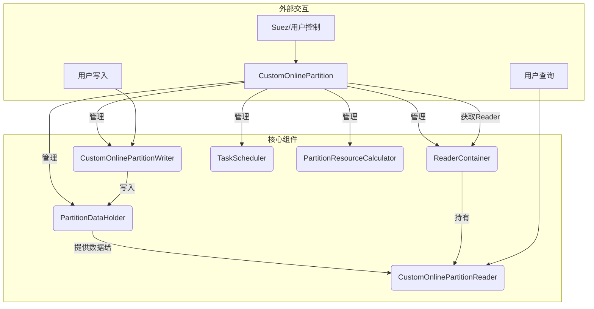

# Indexlib自定义在线分区核心揭秘：`CustomOnlinePartition` 深度解析

**涉及文件:**
*   `indexlib/partition/custom_online_partition.h`
*   `indexlib/partition/custom_online_partition.cpp`

## 1. 引言：`CustomOnlinePartition` 在Indexlib中的核心地位

在Indexlib的在线服务体系中，`CustomOnlinePartition` 扮演着发动机的角色。它不仅仅是一个类，更是整个在线索引分区（Partition）的生命周期管理器和总协调者。从索引的加载、初始化，到实时数据的写入、构建，再到新版本索引的无缝切换（Reopen），以及最终服务的平稳关闭，所有核心流程都由它统一调度和管理。

对于需要使用Indexlib构建实时搜索服务的开发者来说，深入理解 `CustomOnlinePartition` 的内部机制至关重要。它不仅能帮助我们更好地利用Indexlib的各项功能，还能在遇到性能瓶颈或疑难杂症时，提供清晰的排查思路。本文档将深入剖析 `CustomOnlinePartition` 的设计理念、核心工作流程、关键技术实现以及潜在的技术风险，旨在为读者呈现一个全面而深刻的系统视图。

## 2. 整体架构与设计理念

`CustomOnlinePartition` 的设计核心是**状态驱动**和**责任分离**。

*   **状态驱动**：整个对象生命周期被明确划分为几个核心状态（`IndexPhase`），如 `PENDING`（初始）、`OPENING`（打开中）、`NORMAL_REOPEN`（增量重载中）、`REOPEN_RT`（实时部分重载中）等。所有的核心操作，如 `Open`、`Reopen`、`Close`，都伴随着状态的流转。这种设计使得在并发环境下，对分区状态的管理和判断变得清晰可靠，避免了混乱的操作。

*   **责任分离**：`CustomOnlinePartition` 自身并不直接执行所有的具体任务，而是将不同的职责委托给专门的组件。例如：
    *   **写入 (Write)**：委托给 `CustomOnlinePartitionWriter`，负责处理实时文档的写入、构建（Build）和转储（Dump）。
    *   **读取 (Read)**：委托给 `CustomOnlinePartitionReader`，负责提供对当前索引版本的数据查询服务。
    *   **版本管理 (Version Management)**：通过 `PartitionDataHolder` 持有和管理不同版本的 `PartitionData`。
    *   **Reader管理 (Reader Management)**：通过 `ReaderContainer` 管理多个版本的Reader实例，以支持平滑的Reopen。
    *   **资源计算与清理 (Resource Management)**：通过 `PartitionResourceCalculator` 和 `ExecutorScheduler`（内含 `OnDiskIndexCleaner` 等）来监控内存使用和清理过期文件。
    *   **后台任务 (Background Tasks)**：通过 `TaskScheduler` 调度周期性任务，如指标上报、资源清理等。

这种面向接口和组件的设计，使得 `CustomOnlinePartition` 的主逻辑更加聚焦于流程控制和状态协调，而具体的实现细节则被封装在各自的模块中，大大提高了代码的可维护性和扩展性。

下图展示了 `CustomOnlinePartition` 与其核心协作组件的关系：



## 3. 核心流程深度剖析

### 3.1. 启动与打开 (Open)

`Open` 是分区的入口点，负责从磁盘加载一个指定的索引版本（`targetVersionId`），并将其初始化为可服务的状态。整个过程是一个严谨、容错性强的初始化序列。

**核心逻辑 (`DoOpen`):**

1.  **环境准备与参数校验**：
    *   设置IO异常重试策略（次数和间隔），增强鲁棒性。
    *   解析并设置内存水位线（`high_mem_used_watermark`, `low_mem_used_watermark`）等高级参数。
    *   调用父类 `IndexPartition::Open`，完成基础目录和文件系统（`IFileSystem`）的初始化。
    *   校验传入的 `IndexPartitionOptions` 和 `IndexPartitionSchema`，确保配置合法。

2.  **加载磁盘版本 (On-Disk Version)**：
    *   通过 `VersionLoader::GetVersionS` 从远端（`secondaryDir`）或本地（`primaryDir`）存储中，找到目标版本 `targetVersionId` 对应的 `Version` 对象。这个 `Version` 对象详细描述了该版本包含的所有Segment文件。
    *   **挂载文件系统（Mount）**：这是关键一步。Indexlib的 `IFileSystem` 会根据 `Version` 对象中的信息，将所有需要的Segment文件以只读方式（`FSMT_READ_ONLY`）挂载到逻辑文件系统中。这一步并不一定涉及真实的文件拷贝，可能是通过符号链接或内部映射完成，效率较高。同时，它还会加载与版本相关的生命周期（Lifecycle）配置。

3.  **创建分区数据 (`PartitionData`)**：
    *   `PartitionData` 是索引在内存中的核心数据结构，它代表了一个特定版本的全量和增量数据视图。
    *   调用 `PartitionDataCreator::CreateCustomPartitionData` 创建一个 `CustomPartitionData` 实例。这个实例会持有对已挂载文件系统的引用，并管理着版本内的所有Segment数据。
    *   在创建过程中，如果配置了 `enableRecoverIndex`，它会尝试恢复上次异常退出时可能存在的实时内存（In-Memory）Segment，保证数据不丢失。

4.  **初始化写入器 (`Writer`)**：
    *   如果分区不是只读的（`!mOptions.TEST_mReadOnly`），则创建并初始化 `CustomOnlinePartitionWriter`。
    *   `Writer` 会与 `PartitionData` 关联，它后续的写入和构建操作都将基于这个 `PartitionData` 实例进行。

5.  **初始化读取器 (`Reader`)**：
    *   **内存预估与预留**：在创建Reader前，会通过 `PartitionResourceCalculator` 预估加载这个版本需要消耗的内存。然后通过 `MemoryReserver` 尝试从内存配额控制器（`mPartitionMemController`）中预留这部分内存。如果内存不足，会抛出 `OutOfMemory` 异常，防止系统因内存耗尽而崩溃。
    *   调用 `InitReader` 创建 `CustomOnlinePartitionReader` 实例。Reader的初始化过程会真正地去加载索引文件（如倒排、正排、summary等）到内存中，或建立内存映射。
    *   **切换Reader (`SwitchReader`)**：新创建的Reader准备就绪后，通过 `SwitchReader` 方法将其原子性地设置为当前服务的Reader。同时，这个Reader实例会被加入到 `ReaderContainer` 中进行版本管理。

6.  **启动后台任务**：
    *   通过 `PrepareIntervalTask` 启动一系列周期性任务，包括：
        *   `clean_resource`: 清理过期的磁盘文件和内存中的旧Segment。
        *   `clean_reader`: 清理不再被使用的旧版本Reader。
        *   `report_metrics`: 定期上报分区的各项性能和状态指标。
        *   `refresh_reader`: 异步处理Dump任务，并将Dump好的Segment更新到Reader中。
        *   `check_realtime_build`: 检查实时构建的状态，如内存是否达到阈值。

**关键代码片段 (`DoOpen`)**

```cpp
// indexlib/partition/custom_online_partition.cpp

IndexPartition::OpenStatus CustomOnlinePartition::DoOpen(const string& primaryDir, const string& secondaryDir,
                                                         const IndexPartitionSchemaPtr& schema,
                                                         const IndexPartitionOptions& options,
                                                         versionid_t targetVersionId, bool isForceOpen)
{
    // ... 参数设置与校验 ...

    // 1. 加载磁盘版本元信息
    Version onDiskVersion;
    VersionLoader::GetVersionS(secondaryDir, onDiskVersion, targetVersionId);

    // 2. 根据版本元信息，挂载文件
    if (unlikely(onDiskVersion.GetVersionId() == INVALID_VERSIONID)) {
        // 处理空版本情况
    } else {
        // 根据是否读远端，选择从主路或副路挂载
        if (!mOptions.GetOnlineConfig().NeedReadRemoteIndex()) {
            THROW_IF_FS_ERROR(mFileSystem->MountVersion(primaryDir, onDiskVersion.GetVersionId(), "", FSMT_READ_ONLY,
                                                        versionLevelLifecycleTable),
                              "mount version failed");
        } else {
            // ... 从secondaryDir挂载 ...
        }
    }
    
    // ... Schema加载与兼容性检查 ...

    // 3. 创建核心数据结构 PartitionData
    PartitionDataPtr newPartitionData =
        CreateCustomPartitionData(onDiskVersion, index_base::Version(INVALID_VERSIONID), versionDpDesc,
                                  mDumpSegmentQueue, GetReclaimTimestamp(onDiskVersion), false);
    mPartitionDataHolder.Reset(newPartitionData);

    // 4. 初始化写入器 (如果非只读)
    if (!mOptions.TEST_mReadOnly) {
        mWriter.reset(new CustomOnlinePartitionWriter(mOptions, mTableFactory, mFlushedLocatorContainer,
                                                      mOnlinePartMetrics.get(), mPartitionName));
        InitWriter(mPartitionDataHolder.Get(), mWriter);
    }

    // 5. 初始化读取器 (包含内存预估)
    InitResourceCalculator(mPartitionDataHolder.Get(), mWriter);
    PartitionDataPtr clonedPartitionData(mPartitionDataHolder.Get()->Clone());
    auto reader =
        InitReaderWithMemoryLimit(clonedPartitionData, mWriter, index_base::Version(INVALID_VERSIONID), onDiskVersion);

    // 6. 原子切换Reader，对外提供服务
    SwitchReader(reader);
    MEMORY_BARRIER();

    // ... 初始化资源清理器、启动后台任务 ...
    if (!PrepareIntervalTask()) {
        return OS_FAIL;
    }
    
    mClosed = false;
    mIsServiceNormal = true;
    IE_PREFIX_LOG(INFO, "Open Index Partition End");
    return OS_OK;
}
```

### 3.2. 增量重载 (ReOpen)

`ReOpen` 是在线服务的核心能力，它允许系统在不停止服务的前提下，加载一个新的、包含更多增量数据的索引版本。

**决策逻辑 (`MakeReopenDecision`)**

在执行Reopen前，系统会先做出一系列决策：

1.  **获取新版本**：从磁盘获取 `targetVersionId` 对应的新版本 `reopenVersion`。
2.  **版本号比较**：如果 `reopenVersion` 的版本号不大于当前已加载的版本号，则无需Reopen (`NO_NEED_REOPEN`)。
3.  **Schema比较**：如果 `reopenVersion` 的Schema版本与当前不一致，则无法兼容，返回 `INCONSISTENT_SCHEMA_REOPEN`。
4.  **时间戳比较**：如果 `reopenVersion` 的时间戳小于当前版本，可能意味着版本回滚，返回 `INDEX_ROLL_BACK_REOPEN`。
5.  **强制Reopen**：如果外部指定了 `forceReopen`，则执行 `FORCE_REOPEN`。这通常是一种兜底策略，会丢弃所有内存中的实时数据，直接切换到新版本，类似于一次强制的 `Open`。
6.  **正常Reopen**：如果以上都不是，则执行 `NORMAL_REOPEN`。

**正常重载流程 (`NormalReopen`)**

1.  **创建新PartitionData**：与 `Open` 类似，首先为新版本 `incVersion` 创建一个新的 `PartitionData` 实例。这个新的 `PartitionData` 会包含旧版本的所有Segment以及新版本的增量Segment。
2.  **准备Writer资源**：`Writer` 需要为新版本准备必要的表格资源（`TableResource`）。
3.  **重置Writer**：将 `Writer` 内部引用的 `PartitionData` 和 `TableResource` 更新为新版本的实例。这是一个关键的原子操作，确保后续的写入都进入新的数据视图。
4.  **创建新Reader**：调用 `InitReaderWithMemoryLimit` 创建一个与新 `PartitionData` 关联的新 `Reader`。这一步同样有内存预估和预留机制。
5.  **重置PartitionDataHolder**：将 `PartitionDataHolder` 中持有的 `PartitionData` 实例更新为新的实例。
6.  **处理内存Segment**：检查当前正在构建的内存Segment（building segment）的时间戳。如果它比新版本的回收时间戳还要旧，说明这个Segment已经可以被固化了，会触发一次 `DumpSegment` 操作。
7.  **切换Reader**：最后，调用 `SwitchReader` 将新Reader设置为当前服务Reader，并将旧Reader放入 `ReaderContainer` 中等待被清理。`MEMORY_BARRIER()` 确保了多线程环境下的可见性。

**Force Reopen 与 Normal Reopen 的区别**

*   **Normal Reopen**：是“优雅”的切换。它会保留内存中的实时数据（RT），并将它们与新的磁盘版本进行合并，形成一个完整的视图。整个过程对查询服务是无感的。
*   **Force Reopen**：是“粗暴”的切换。它会放弃所有内存中的数据，直接加载磁盘上的新版本。这会导致内存中尚未Dump的实时数据丢失，通常只在系统出现严重不一致或需要紧急恢复时使用。在 `CustomOnlinePartition` 的实现中，它通过先 `Close()` 再 `Open()` 来模拟这种行为。

### 3.3. 关闭 (Close)

`Close` 负责平稳地停止分区服务，并释放所有资源。

**核心逻辑 (`DoClose`)**

1.  **停止后台任务**：通过 `mTaskScheduler->DeleteTask` 停掉所有周期性任务。
2.  **清理Reader**：锁定并清理 `ReaderContainer`，确保所有旧版本的Reader都被释放。同时，会检查当前主Reader (`mReader`) 的引用计数，如果大于1，说明外部还有查询在持有Reader，此时强行关闭会产生风险，因此会抛出 `InconsistentState` 异常。
3.  **关闭Writer**：调用 `mWriter->Close()`，这会确保所有内存中的数据都被安全地处理（例如，触发最后的Dump）。
4.  **清理核心数据**：重置 `mPartitionDataHolder`，释放 `PartitionData` 及其管理的内存和文件句柄。
5.  **文件系统同步**：调用 `mFileSystem->Sync(true)`，确保所有文件系统的操作都已落盘。
6.  **资源释放**：最后，重置 `mTableFactory`, `mPluginManager`, `mFileSystem` 等核心组件，彻底释放所有资源。

## 4. 内存管理与资源控制

`CustomOnlinePartition` 对内存的使用有严格的控制，这是保证在线服务稳定性的基石。

*   **配额控制器 (`MemoryQuotaController`)**：
    *   `mPartitionMemController`: 控制整个分区的总内存配额。
    *   `mRealtimeQuotaController`: 单独控制实时部分（RT）的内存配额。
    *   `mTableWriterMemController`: 单独控制 `TableWriter` 在构建内存Segment时所使用的内存。
    *   这些控制器形成了一个层级结构，可以精细化地管理不同模块的内存使用。

*   **内存预留 (`MemoryReserver`)**：在执行 `Open` 和 `Reopen` 等可能消耗大量内存的操作前，系统会通过 `mFileSystem->CreateMemoryReserver` 创建一个内存预留器，并尝试预留（`Reserve`）所需内存。如果预留失败，操作将被中止，从而避免了潜在的OOM风险。

*   **内存状态检查 (`CheckMemoryStatus`)**：
    *   这是一个周期性或在写入前被调用的函数，用于检查当前内存使用情况。
    *   它会检查实时索引内存（`rtIndexMemUseInMB`）是否超过了最大限制（`maxRealtimeMemSize`）。
    *   同时，它会计算实时内存使用率，并与预设的高低水位线（`mHighMemUsedWatermark`, `mLowMemUsedWatermark`）进行比较。
    *   检查结果（`MemoryStatus`）会指导后续的行为，例如：
        *   `MS_REACH_MAX_RT_INDEX_SIZE`: 达到RT内存上限，可能会触发强制Dump。
        *   `MS_REACH_HIGH_WATERMARK_MEM_LIMIT`: 达到高水位，系统进入“警惕”状态，可能会减缓写入速度或准备Dump。
        *   `MS_REACH_LOW_WATERMARK_MEM_LIMIT`: 达到低水位，系统处于健康状态。

## 5. 技术风险与考量

1.  **Reopen卡顿**：`Reopen` 过程虽然设计为无缝切换，但在加载非常大的增量索引时，`InitReader` 阶段仍然可能消耗较长的时间和大量的CPU、IO资源，可能对在线服务的RT造成瞬时影响。`NormalReopenWithSegmentLevelPreload` 尝试通过预加载部分Segment来缓解这个问题。
2.  **内存碎片**：频繁的 `Reopen` 和实时数据写入、Dump，可能会导致内存池（`autil::mem_pool`）中产生碎片，虽然Indexlib有自己的内存管理机制，但在极端情况下仍需关注。
3.  **IO异常处理**：代码中随处可见对 `FileIOException` 的捕获和重试逻辑。这表明底层文件系统（无论是本地盘还是Pangu）的IO抖动是一个需要重点考虑的风险。重试策略（`mIOExceptionRetryLimit`, `mIOExceptionRetryInterval`）的合理配置对服务稳定性至关重要。
4.  **配置复杂性**：`IndexPartitionOptions` 提供了大量可配置参数，如内存配额、线程数、开关等。不合理的配置可能导致性能问题或功能异常。例如，`maxReopenMemoryUse` 如果配置不当，可能导致Reopen因内存不足而频繁失败。
5.  **Reader生命周期管理**：`ReaderContainer` 和 `PartitionReaderCleaner` 的正确工作是防止内存泄漏的关键。如果外部业务代码长时间持有旧的 `IndexPartitionReader` 实例不释放，会导致旧版本无法被清理，内存和文件句柄持续被占用，最终耗尽资源。

## 6. 总结

`CustomOnlinePartition` 是Indexlib在线服务的心脏。它通过精巧的状态管理、清晰的组件化设计和严谨的资源控制，成功地将索引加载、实时写入、版本切换等复杂操作整合在一个统一的框架下。它不仅是功能的实现者，更是服务稳定性的守护者。深入理解其工作原理，对于任何希望在生产环境中使用和运维Indexlib的团队来说，都是一笔宝贵的财富。
