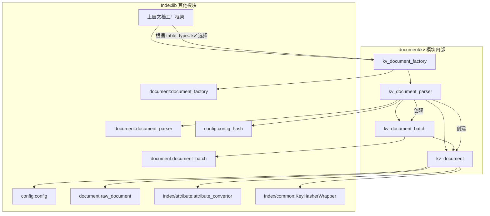

# Indexlib KV 存储引擎：构建定义与依赖解析

**涉及文件:**
*   `document/kv/BUILD`

## 摘要

本文旨在深度解析 Indexlib KV 文档处理模块的 `BUILD` 文件。`BUILD` 文件是基于 Bazel 构建系统的核心，它不仅定义了模块自身的编译单元、源文件和头文件，更重要的是，它清晰地揭示了该模块与 Indexlib 系统中其他组件的依赖关系。通过对 `BUILD` 文件的分析，我们可以精确地理解 KV 文档模块的系统定位、其对外暴露的接口，以及它在整个 Indexlib 生态中的上、下游依赖，从而为二次开发、问题排查和系统架构理解提供关键的蓝图。

## 1. `BUILD` 文件在系统中的作用

在像 Indexlib 这样的大型 C++ 项目中，构建系统扮演着至关重要的角色。它负责将成千上万的源文件编译、链接成最终的可执行文件或库。`BUILD` 文件是这一过程的“指导说明书”。具体到 `document/kv` 目录，其 `BUILD` 文件的核心作用包括：

*   **定义编译目标（Library）**: 将相关的源文件（`.cpp`）和头文件（`.h`）组织成一个或多个逻辑单元，即库（`cc_library`）。
*   **声明依赖关系（deps）**: 明确指出当前模块的编译和运行需要依赖哪些其他的库。这是理解模块间耦合关系的最直接和最准确的依据。
*   **控制可见性（visibility）**: 定义了哪些其他的模块可以依赖（`#include` 或链接）本模块定义的库。这是一种强制的模块化和封装机制。
*   **管理头文件路径**: 通过 `include_prefix` 和 `strip_include_prefix` 等参数，控制头文件的引用路径，使得 `#include` 语句更加规范和统一。

## 2. `document/kv` 模块的库定义分析

`document/kv/BUILD` 文件定义了四个主要的 `cc_library` 目标，这种划分体现了清晰的模块化设计思想。每个库都有明确的职责和边界。

### 2.1 `kv_document`：核心数据结构库

```bazel
cc_library(
    name = 'kv_document',
    srcs = glob(
        ['*.cpp'],
        exclude = [
            '*Test.cpp',
            'KVDocumentBatch.cpp',
            'KVDocumentFactory.cpp',
            'KVDocumentParser.cpp'
        ]
    ),
    hdrs = glob(
        ['*.h'],
        exclude = [
            # ... 同样的排除列表
        ]
    ),
    # ...
    deps = [
        '//aios/autil:log',
        '//aios/autil:string_helper',
        '//aios/storage/indexlib/base:constant',
        '//aios/storage/indexlib/config:config',
        '//aios/storage/indexlib/document:raw_document',
        '//aios/storage/indexlib/index/attribute:attribute_convertor',
        '//aios/storage/indexlib/index/common:KeyHasherWrapper',
        '//aios/storage/indexlib/index/kv:kv_define',
        # ...
    ]
)
```

*   **职责**: 这个库是 KV 文档模块最基础的部分，包含了 `KVDocument`、`KVKeyExtractor`、`ValueConvertor` 等核心数据结构和工具类的定义与实现。它通过 `glob` 和 `exclude` 精确地控制了包含的源文件，将最核心、最稳定的部分聚合在一起。
*   **依赖分析**: 它的依赖（`deps`）揭示了其实现基础：
    *   `//aios/autil`: 依赖阿里巴巴自研的基础库 `autil`，用于日志、字符串处理等。
    *   `//aios/storage/indexlib/base`: 依赖 Indexlib 的基础定义，如 `Status`、`Define` 等。
    *   `//aios/storage/indexlib/config`: 强依赖**配置模块**。这印证了 KV 文档处理是“配置驱动”的，其行为受 `KVIndexConfig`、`ValueConfig` 等控制。
    *   `//aios/storage/indexlib/document:raw_document`: 依赖 `RawDocument`，表明它的功能是从 `RawDocument` 解析数据。
    *   `//aios/storage/indexlib/index/attribute:attribute_convertor` 和 `//aios/storage/indexlib/index/common:KeyHasherWrapper`: 依赖底层的属性转换器和哈希工具，用于实现值的编码和键的哈希。

这个库是整个 KV 文档处理功能的核心，它被后续的 `kv_document_batch` 和 `kv_document_parser` 所依赖。

### 2.2 `kv_document_batch`：批处理封装库

```bazel
cc_library(
    name = 'kv_document_batch',
    srcs = ['KVDocumentBatch.cpp'],
    hdrs = ['KVDocumentBatch.h'],
    # ...
    deps = [
        ':kv_document', 
        '//aios/storage/indexlib/document:document_batch',
        '//aios/storage/indexlib/document:document_iterator'
    ]
)
```

*   **职责**: 专门封装 `KVDocumentBatch` 的实现。它只包含两个文件，职责非常单一。
*   **依赖分析**: 
    *   `':kv_document'`: 直接依赖于本 `BUILD` 文件中定义的 `kv_document` 库。这表明 `KVDocumentBatch` 是 `KVDocument` 的容器。
    *   `//aios/storage/indexlib/document:document_batch`: 依赖通用的 `DocumentBatch` 接口和基类，表明 `KVDocumentBatch` 是 Indexlib 通用文档批处理框架的一个具体实现。
    *   `//aios/storage/indexlib/document:document_iterator`: 依赖文档迭代器，用于遍历批处理中的文档。

### 2.3 `kv_document_parser`：文档解析器库

```bazel
cc_library(
    name = 'kv_document_parser',
    srcs = ['KVDocumentParser.cpp'],
    hdrs = ['KVDocumentParser.h'],
    # ...
    deps = [
        ':kv_document', 
        ':kv_document_batch',
        '//aios/storage/indexlib/config:config_hash',
        '//aios/storage/indexlib/document:builtin_parser_init_param',
        '//aios/storage/indexlib/document:document_parser',
        '//aios/storage/indexlib/index/kv:kv_index_type_str'
    ]
)
```

*   **职责**: 封装 `KVDocumentParser` 的实现，这是将 `RawDocument` 转换为 `KVDocumentBatch` 的核心逻辑所在。
*   **依赖分析**: 
    *   `':kv_document'` 和 `':kv_document_batch'`: 依赖前两者，因为它既要创建 `KVDocument`，也要将它们放入 `KVDocumentBatch`。
    *   `//aios/storage/indexlib/document:document_parser`: 依赖通用的 `IDocumentParser` 接口，表明 `KVDocumentParser` 是一个具体的解析器实现。
    *   `//aios/storage/indexlib/config:config_hash`: 依赖配置哈希工具，用于在处理多 KV 索引时生成唯一的标识符。
    *   `//aios/storage/indexlib/document:builtin_parser_init_param`: 依赖 `BuiltinParserInitParam`，用于获取计数器（Counter）等初始化资源。

### 2.4 `kv_document_factory`：工厂库

```bazel
cc_library(
    name = 'kv_document_factory',
    srcs = ['KVDocumentFactory.cpp'],
    hdrs = ['KVDocumentFactory.h'],
    # ...
    deps = [
        ':kv_document_parser',
        '//aios/storage/indexlib/document:document_factory'
    ]
)
```

*   **职责**: 提供 `KVDocumentFactory`，作为创建 `KVDocumentParser` 的入口。
*   **依赖分析**: 
    *   `':kv_document_parser'`: 它的唯一职责就是创建 `KVDocumentParser`，因此强依赖该库。
    *   `//aios/storage/indexlib/document:document_factory`: 依赖通用的 `DocumentFactoryAdapter`，表明 `KVDocumentFactory` 是整个 Indexlib 文档工厂体系中的一员，会被上层框架统一管理和调用。

## 3. 模块的系统架构图景

通过对 `BUILD` 文件的分析，我们可以绘制出 `document/kv` 模块内部以及它与外部模块的依赖关系图：



这张图清晰地展示了：

*   **分层结构**: `factory` -> `parser` -> `batch` -> `document` 的清晰层次。
*   **接口驱动**: `kv_document_factory`、`kv_document_parser` 和 `kv_document_batch` 都分别依赖于 `document` 目录中定义的通用接口或基类，这使得它们可以被上层框架以一种统一的方式进行管理和调用。
*   **配置依赖**: `kv_document` 和 `kv_document_parser` 都依赖于 `config` 模块，再次印证了其配置驱动的特性。
*   **关注点分离**: 哈希、字段转换等底层功能被委托给了更通用的模块（`KeyHasherWrapper`, `AttributeConvertor`），`document/kv` 模块自身则专注于 KV 业务逻辑的编排。

## 4. 技术风险与构建维护

*   **依赖膨胀**: `kv_document` 库的依赖项较多。在未来的开发中，需要警惕无意中引入新的、不必要的依赖，这会增加编译时间和耦合度。任何新的依赖都应该经过仔细评估。
*   **循环依赖**: 当前的 `BUILD` 文件中没有循环依赖，结构清晰。在修改时，必须避免引入库之间的循环依赖，例如让 `kv_document` 反过来依赖 `kv_document_parser`，这将导致构建失败。
*   **可见性控制**: `visibility = ['//aios/storage/indexlib:__subpackages__']` 意味着 `indexlib` 目录下的所有子包都可以依赖这些库。这是一个相对宽松的设置。在更严格的架构中，可能会将可见性限制在更小的范围，例如只允许特定的上层模块（如 `builder`）依赖它。

## 5. 结论

`document/kv/BUILD` 文件以一种极其精确和无歧义的方式，定义了 KV 文档处理模块的内部结构和外部依赖。它不仅是编译系统的输入，更是理解模块架构、定位其在系统中角色的“活文档”。通过对其进行深入分析，我们确认了该模块遵循了良好的软件工程实践：**高内聚、低耦合、接口驱动、分层设计**。这种清晰的构建定义，为 Indexlib 系统的稳定性、可维护性和可扩展性提供了坚实的保障。
