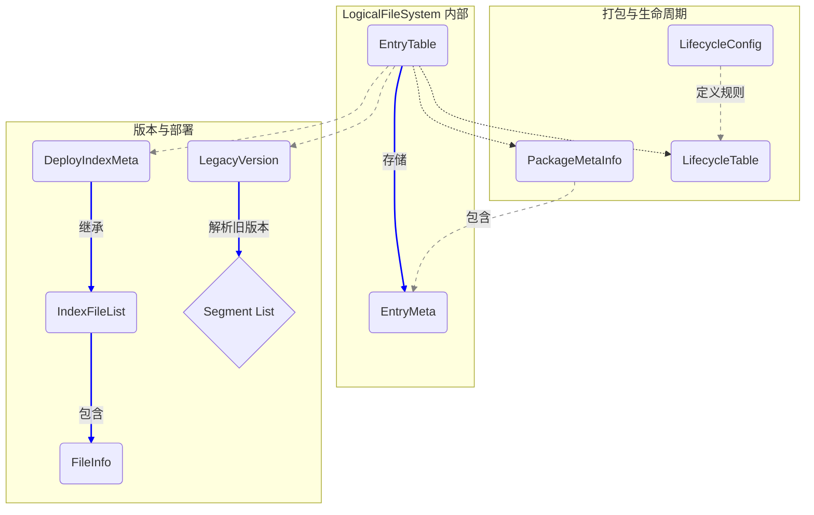

# Indexlib 文件系统：文件元信息与版本管理

**涉及文件:**
* `file_system/EntryMeta.h`
* `file_system/EntryMeta.cpp`
* `file_system/FileInfo.h`
* `file_system/IndexFileList.h`
* `file_system/IndexFileList.cpp`
* `file_system/DeployIndexMeta.h`
* `file_system/LegacyVersion.h`
* `file_system/LegacyVersion.cpp`
* `file_system/PackageMetaInfo.h`
* `file_system/PackageMetaInfo.cpp`
* `file_system/LifecycleConfig.h`
* `file_system/LifecycleConfig.cpp`
* `file_system/LifecycleTable.h`
* `file_system/LifecycleTable.cpp`

## 1. 概述

在 Indexlib 的文件系统中，元数据是连接逻辑视图与物理存储的桥梁。本篇文档聚焦于文件系统中的元数据核心——`EntryMeta`，以及与之相关的版本管理、部署清单和生命周期管理机制。这些组件共同协作，确保了文件系统能够准确、高效地管理海量文件，并支持复杂的版本迭代和部署需求。

该模块的核心设计目标是：

*   **全面的元信息**: 为每个文件和目录提供丰富且紧凑的元信息描述，包括逻辑路径、物理路径、大小、类型、权限等。
*   **版本化管理**: 支持索引的版本化，能够清晰地定义每个版本包含的文件列表。
*   **部署灵活性**: 生成部署清单（`DeployIndexMeta`），指导索引文件在不同环境（本地、远端）之间的同步和部署。
*   **向后兼容性**: 能够解析旧版本的索引元数据格式，保证系统的平滑升级。
*   **生命周期管理**: 允许为不同类型的文件定义不同的生命周期策略，优化存储成本。

## 2. 系统架构

元数据和版本管理模块是 `LogicalFileSystem` 内部运作的基石。其核心是 `EntryTable`（在上一篇文档中提到），一个存储 `EntryMeta` 实例的内存数据库。本篇分析的类则是构成 `EntryTable` 内容以及与外部系统（如部署系统）交互的数据结构。



*   `EntryMeta` 是最基础的元数据单元，被 `EntryTable` 和 `PackageMetaInfo` 使用。
*   `IndexFileList` 和 `DeployIndexMeta` 构成了版本发布的清单文件，用于描述一个完整索引版本包含哪些文件。
*   `LegacyVersion` 用于在挂载旧版本时，解析其特有的 `version.X` 文件格式。
*   `LifecycleConfig` 和 `LifecycleTable` 共同决定了文件系统中各个路径的存储策略。

## 3. 关键实现细节

### 3.1. `EntryMeta`：万物之源

`EntryMeta` 是文件系统中最为核心和精巧的数据结构之一。它用一个非常紧凑的内存布局，存储了一个文件或目录的所有必要信息。

#### 3.1.1. 核心职责

*   **标识**: 存储逻辑路径 (`_logicalPath`) 和物理路径信息 (`_physicalPath`, `_physicalRoot`)。
*   **类型与大小**: 通过 `_length` 字段区分文件（`>=0`）和目录（`-2`）。
*   **属性**: 使用一个 `uint64_t` 的 `_unionAttribute`，通过位域 (bit-field) 的方式，高效地存储了多个布尔标记和文件偏移量。

#### 3.1.2. 关键代码分析：位域设计

`EntryMeta` 最具特色的设计在于其 `union` 和位域，这极大地节省了内存空间，对于需要缓存大量元数据的 `EntryTable` 来说至关重要。

```cpp
// in EntryMeta.h

class EntryMeta : public autil::legacy::Jsonizable
{
private:
    // ... 其他成员 ...
    int64_t _length = 0;
    union {
        struct {
            int64_t _offset     : 52; // 文件在包内的偏移，最大 4PB
            uint64_t _reserved  : 7;  // 预留位
            uint64_t _isNoEnt   : 1;  // 是否为不存在的条目（用于缓存）
            uint64_t _isMutable : 1;  // 是否可变
            uint64_t _isOwner   : 1;  // 当前文件系统是否拥有此条目
            uint64_t _isMemFile : 1;  // 是否为纯内存文件
            uint64_t _isLazy    : 1;  // 是否为懒加载目录
        };
        uint64_t _unionAttribute = 0;
    };
    // ...
};
```

*   **`_offset` (52 bits)**: 当文件被打包到 `package_file` 中时，这个字段记录了它在包内的起始偏移。52 位的长度可以支持高达 4PB (2^52) 的包文件，远超当前需求。
*   **布尔标记 (1 bit each)**:
    *   `_isNoEnt`: 标记一个路径查询结果为空，用于缓存未命中，避免重复的物理存储查询。
    *   `_isMutable`: 标记文件/目录是否可变。对于目录，决定了新文件是写入 `outputRoot` 还是 `patchRoot`；对于文件，标记是否由当前文件系统创建。
    *   `_isOwner`: 标记当前文件系统是否“拥有”这个条目，主要用于决定在删除时是否需要物理删除文件。
    *   `_isMemFile`: 标记一个文件是否是纯内存文件，不会被持久化到 `EntryTable` 的快照中。
    *   `_isLazy`: 标记一个目录是否是“懒加载”的，其下的子条目可能还未完全加载到 `EntryTable` 中。

这种设计以极小的空间开销，赋予了每个文件条目丰富的语义，是系统高性能和功能多样性的基础。

### 3.2. `IndexFileList` 与 `DeployIndexMeta`：版本的蓝图

当一个索引版本构建完成并准备发布时，需要一个清单文件来描述这个版本包含了哪些文件和目录。这就是 `IndexFileList` 和 `DeployIndexMeta` 的作用。

*   **`FileInfo`**: 一个简单的结构体，包含文件路径、长度和修改时间，是构成文件列表的基本单元。
*   **`IndexFileList`**: 包含了两个 `FileInfo` 的 `vector`：`deployFileMetas` 和 `finalDeployFileMetas`。前者是版本的主体文件，后者是部署完成后才生成的最终文件（如 `version.X` 文件本身）。它提供了序列化/反序列化、排序、去重、集合求差等实用功能。
*   **`DeployIndexMeta`**: 继承自 `IndexFileList`，并增加了 `sourceRootPath` 和 `targetRootPath` 两个字段。这使得部署系统可以知道索引的原始构建路径和目标部署路径，从而实现更灵活的部署策略（例如，从一个 Pangu 集群同步到另一个）。

```cpp
// in DeployIndexMeta.h

class DeployIndexMeta : public IndexFileList
{
public:
    // 原始构建的根目录
    std::string sourceRootPath;
    // 目标部署的根目录
    std::string targetRootPath;
    void Jsonize(autil::legacy::Jsonizable::JsonWrapper& json) noexcept(false) override
    {
        IndexFileList::Jsonize(json);
        json.Jsonize("source_root_path", sourceRootPath, sourceRootPath);
        json.Jsonize("target_root_path", targetRootPath, targetRootPath);
    }
    // ...
};
```

在实践中，构建流程的最后一步会生成一个 `deploy_meta.X` 文件，其内容就是 `DeployIndexMeta` 的 JSON 序列化字符串。部署系统读取这个文件，就能精确地知道需要同步哪些文件到线上机器。

### 3.3. `PackageMetaInfo`：化零为整的艺术

索引中常常包含大量的小文件（如词典、倒排拉链等），直接存储在分布式文件系统上会带来严重的元数据压力和 I/O 性能问题。Indexlib 的 `package_file` 机制通过将多个逻辑文件合并到一个物理文件中来解决这个问题。

`PackageMetaInfo` 就是 `package_file` 的元数据描述文件，它本质上是一个 `package_file.__meta__` 文件的内存表示。

```cpp
// in PackageMetaInfo.h

class PackageMetaInfo : public autil::legacy::Jsonizable
{
public:
    // 整个包数据文件的总长度
    int64_t length;
    // 描述包内每个文件的元信息
    std::map<std::string, EntryMeta> files;
    void Jsonize(autil::legacy::Jsonizable::JsonWrapper& json) override;
    // ...
};
```

*   `length`: 对应 `package_file.__data__` 文件的总大小。
*   `files`: 一个从 **逻辑文件路径** 到其 `EntryMeta` 的映射。这里的 `EntryMeta` 非常关键，它的 `_offset` 字段记录了该逻辑文件在 `__data__` 文件中的起始位置，`_length` 字段记录了其大小。

当 `LogicalFileSystem` 需要读取一个包内文件时，它会：
1.  查 `EntryTable`，找到该文件的 `EntryMeta`，发现它 `IsInPackage()`。
2.  根据 `EntryMeta` 的物理路径找到对应的 `package_file.__meta__`。
3.  加载并解析 `PackageMetaInfo`。
4.  从 `PackageMetaInfo` 中再次查找该文件的 `EntryMeta`，获得其在 `__data__` 文件中的 `offset` 和 `length`。
5.  最终从 `__data__` 文件的指定位置读取数据。

### 3.4. `Lifecycle` 管理：精细化的存储策略

为了优化存储成本，Indexlib 允许为不同的文件路径配置不同的生命周期（Lifecycle）。例如，可以将冷数据（不常访问的旧 segment）放到更廉价的存储介质上。

*   **`LifecycleConfig`**: 定义了 **路径模式** 到 **生命周期标识** 的匹配规则。它通常由用户在 schema 或配置文件中定义。
    ```json
    {
        "patterns": [
            { "pattern": "/segment_1_level_1/", "lifecycle": "COLD" },
            { "pattern": "/**/summary/", "lifecycle": "HOT" }
        ]
    }
    ```
*   **`LifecycleTable`**: 在版本构建或加载时，`LogicalFileSystem` 会根据 `LifecycleConfig` 和版本内的实际文件路径，生成一个具体的 `LifecycleTable`。它是一个从 **具体目录路径** 到 **生命周期标识** 的映射。这个 `LifecycleTable` 会在 `MountVersion` 时传递给文件系统，文件系统据此为不同目录下的文件应用不同的存储策略（如不同的缓存配置、不同的物理存储位置等）。

## 4. 技术风险与考量

*   **元数据膨胀**: 随着文件数量的增加，`EntryTable` 和 `PackageMetaInfo` 的内存占用会持续增长。虽然 `EntryMeta` 的设计非常紧凑，但在亿级别文件量的场景下，内存消耗依然不可忽视。需要有策略地进行版本合并和回收来控制元数据总量。
*   **兼容性包袱**: `LegacyVersion` 的存在说明系统需要处理历史格式。在未来，如果文件格式再次演进，需要谨慎地增加新的兼容逻辑，避免代码过于复杂和难以维护。
*   **JSON 序列化性能**: 系统中大量元数据都使用 `autil::legacy::Jsonizable` 进行序列化。JSON 格式可读性好，但性能相比二进制格式（如 Protobuf, FlatBuffers）有一定差距。在元数据非常庞大时，解析 `deploy_meta` 或 `package_meta` 可能成为一个耗时步骤。

## 5. 总结

Indexlib 的元数据与版本管理机制是其强大功能和灵活性的核心体现。通过 `EntryMeta` 的精巧设计、`IndexFileList` 的清晰描述、`PackageMetaInfo` 的高效打包以及 `Lifecycle` 的精细化控制，文件系统得以在不同规模和应用场景下都能高效、可靠地工作。这些设计共同构成了 Indexlib 存储层的坚固基石。
