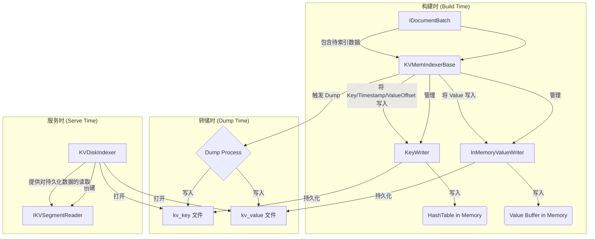

# Indexlib KV 存储核心：索引构建与写入机制深度解析

**涉及文件:**
* `index/kv/KVMemIndexerBase.h`
* `index/kv/KVMemIndexerBase.cpp`
* `index/kv/KVDiskIndexer.h`
* `index/kv/KVDiskIndexer.cpp`
* `index/kv/InMemoryValueWriter.h`
* `index/kv/InMemoryValueWriter.cpp`
* `index/kv/KeyWriter.h`
* `index/kv/KeyWriter.cpp`

## 1. 引言

在 Indexlib 的 KV 存储体系中，索引的构建与写入是连接实时数据与持久化存储的关键环节。这一过程不仅要保证数据写入的正确性和高效性，还要兼顾内存使用的优化和对不同数据格式的适应性。本文档旨在深入剖析 Indexlib KV 模块中负责索引构建与写入的核心组件，揭示其从接收文档、内存中建立索引，到最终持久化到磁盘的完整流程和技术细节。

我们将重点分析 `KVMemIndexerBase` 这一内存索引器的基石，以及其依赖的两个核心写入器：`KeyWriter` 和 `InMemoryValueWriter`。同时，我们也会探讨 `KVDiskIndexer` 如何在索引加载时，为持久化的数据提供访问接口。通过对这些组件的深入理解，读者将能掌握 Indexlib KV 索引“从无到有”的构建过程，洞悉其高性能写入背后的设计哲学。

## 2. 系统架构与设计理念

Indexlib KV 的索引构建与写入架构，遵循了**内存优先、批处理、关注分离**的设计原则，旨在实现高吞吐、低延迟的数据接收和持久化。

*   **内存优先 (In-Memory First)**：所有的数据更新（增、删）首先在内存中进行。`KVMemIndexerBase` 及其子类在内存中维护一个完整的哈希表，用于存储最新的键值对。这种设计可以极大地提升写入性能，因为内存操作远快于磁盘 I/O。只有当内存使用达到阈值或外部指令触发时，才会将内存中的数据“转储”（Dump）到磁盘，形成一个持久化的段（Segment）。
*   **关注分离 (Separation of Concerns)**：系统将键（Key）和值（Value）的写入逻辑分离到不同的组件中。`KeyWriter` 专职负责哈希表的构建和管理，包括键的插入、删除、查找以及哈希表本身的内存分配和持久化。而 `InMemoryValueWriter` 则专注于值的存储，特别是对于变长值，它需要管理一个可扩展的内存区域来存放所有的值数据。这种分离使得各自的实现可以独立优化，例如，`KeyWriter` 可以专注于哈希算法和冲突解决，而 `InMemoryValueWriter` 可以专注于内存管理和压缩策略。
*   **抽象基类与具体实现**：`KVMemIndexerBase` 作为一个抽象基类，定义了内存索引器的通用行为和接口（如 `Init`, `Build`, `Dump`）。而具体的实现则由其子类（如 `FixedLenKVMemIndexer` 和 `VarLenKVMemIndexer`，虽然未在本次分析的文件列表中，但其存在是该设计的必然结果）完成。这种设计模式使得系统可以轻松地支持不同类型的 KV 索引（如定长值 vs. 变长值），而上层调用者无需关心其内部差异。
*   **从内存到磁盘的转换**：`KVDiskIndexer` 扮演了内存索引到磁盘索引的“转换者”角色。当一个内存段被 Dump 到磁盘后，它就不再是 `KVMemIndexer`，而是一个持久化的文件集合。在下一次查询加载时，`KVDiskIndexer` 负责打开这些磁盘文件，并创建一个 `IKVSegmentReader` 实例，为查询提供服务。它标志着索引生命周期从“构建时”到“服务时”的转变。

### 2.1 核心组件关系图



上图清晰地展示了索引构建与写入的生命周期。在**构建时**，`KVMemIndexerBase` 接收 `IDocumentBatch`，并将解析出的键和值分别委托给 `KeyWriter` 和 `InMemoryValueWriter` 处理，数据暂存于内存中的哈希表和值缓冲区。当**转储时**，`KVMemIndexerBase` 启动 Dump 流程，`KeyWriter` 和 `InMemoryValueWriter` 分别将自己的内存数据写入到磁盘上的 `kv_key` 和 `kv_value` 文件。最终，在**服务时**，`KVDiskIndexer` 会加载这些文件，并准备好一个 `IKVSegmentReader` 以供查询使用。

## 3. 关键组件深度解析

### 3.1. `KeyWriter`：哈希表的“建筑师”

`KeyWriter` 是 KV 索引构建的核心，它封装了对底层哈希表的所有操作。无论是定长还是变长 KV，其“键”的部分（在变长场景下，实际存储的是指向 Value 的偏移量）都由 `KeyWriter` 来管理。

**设计动机**：

*   **封装复杂性**：哈希表的实现（如 Cuckoo Hashing, Dense Hashing）和管理（内存分配、扩容、序列化）是复杂的。`KeyWriter` 将这些复杂性封装起来，为上层 `KVMemIndexerBase` 提供一个简洁的 `Add`, `Delete`, `Find` 接口。
*   **统一接口，不同实现**：通过 `KVTypeId`，`KeyWriter` 在 `Init` 阶段就能确定应该创建哪种类型的哈希表（通过 `FixedLenHashTableCreator` 或 `VarLenHashTableCreator`）。这使得 `KeyWriter` 的接口保持稳定，而底层实现可以灵活替换。
*   **性能与内存控制**：`AllocateMemory` 方法允许精确控制哈希表的内存使用和填充率（`occupancyPct`），这对于优化内存占用和避免哈希冲突至关重要。

**核心实现**：

`KeyWriter` 的初始化过程是其设计的精髓所在。它根据 `KVTypeId` 来决定哈希表的具体类型和行为。

```cpp
// index/kv/KeyWriter.cpp

Status KeyWriter::Init(const KVTypeId& typeId)
{
    std::unique_ptr<HashTableInfo> hashTableInfo;
    if (typeId.isVarLen) {
        // 对于变长 KV，使用 VarLenHashTableCreator
        hashTableInfo = VarLenHashTableCreator::CreateHashTableForWriter(typeId);
    } else {
        // 对于定长 KV，使用 FixedLenHashTableCreator
        hashTableInfo = FixedLenHashTableCreator::CreateHashTableForWriter(typeId);
    }
    if (!hashTableInfo) {
        return Status::InternalError("create hash table failed for type: %s", typeId.ToString().c_str());
    }
    _typeId = typeId;
    // 从 HashTableInfo 中“窃取”哈希表实例和值打包器
    _hashTable = hashTableInfo->StealHashTable<HashTableBase>();
    _valuePacker = std::move(hashTableInfo->valueUnpacker);
    _bucketCompressor = std::move(hashTableInfo->bucketCompressor);
    return Status::OK();
}
```

`Add` 和 `Delete` 方法展示了 `KeyWriter` 如何与 `ValueUnpacker` 协作。`ValueUnpacker` 负责将值（或偏移量）和时间戳打包成一个紧凑的格式，以便存入哈希表。

```cpp
// index/kv/KeyWriter.cpp

Status KeyWriter::Add(uint64_t key, const autil::StringView& value, uint32_t timestamp)
{
    // 使用 _valuePacker 将 value 和 timestamp 打包后再插入哈希表
    auto succ = _hashTable->Insert(key, _valuePacker->Pack(value, timestamp));
    if (likely(succ)) {
        return Status::OK();
    }
    // 如果插入失败（通常是因为哈希表满了），返回 NeedDump 信号
    return Status::NeedDump("key no space");
}

Status KeyWriter::Delete(uint64_t key, uint32_t timestamp)
{
    // 删除操作也是一次插入，插入一个带有删除标记的特殊值
    bool succ = _hashTable->Delete(key, _valuePacker->Pack(autil::StringView::empty_instance(), timestamp));
    if (likely(succ)) {
        return Status::OK();
    }
    return Status::NeedDump("key no space");
}
```

`Dump` 方法负责将内存中的哈希表内容原封不动地写入磁盘文件 `KV_KEY_FILE_NAME`。它还支持可选的收缩（`shrink`）和压缩（`compress`）操作，以优化磁盘空间占用。

### 3.2. `InMemoryValueWriter`：变长值的“内存管家”

对于变长值的 KV 索引，值的长度不固定，无法直接存储在哈希表中。`InMemoryValueWriter` 的职责就是高效地管理一块专用于存储这些变长值的内存区域，并为 `KeyWriter` 提供一个稳定的“地址”（即偏移量）。

**设计动机**：

*   **集中管理变长数据**：将所有变长值连续存储在一块内存中，可以减少内存碎片，提高内存使用效率。
*   **可扩展性**：通过使用 `ExpandableValueAccessor`，值存储区可以在需要时动态扩展，以适应不断增长的数据量。
*   **支持压缩和回收**：`InMemoryValueWriter` 的设计考虑了值的压缩。在 `Dump` 时，它可以与 `CompressFileWriter` 配合，将值数据压缩后写入磁盘。此外，它还集成了内存回收机制（`ReclaimedValueCollector`），允许重用已删除或更新的值所占用的空间，进一步优化内存使用。

**核心实现**：

`InMemoryValueWriter` 的核心是 `_valueAccessor`，一个 `ExpandableValueAccessor` 实例，它真正负责内存的分配和管理。

```cpp
// index/kv/InMemoryValueWriter.h

class InMemoryValueWriter final : public ValueWriter
{
    // ...
private:
    std::shared_ptr<indexlibv2::config::KVIndexConfig> _indexConfig;
    // 可扩展的值访问器
    std::shared_ptr<indexlibv2::index::ExpandableValueAccessor<uint64_t>> _valueAccessor;
    // 用于回收空间的值收集器
    std::shared_ptr<ReclaimedValueCollector<uint64_t>> _reclaimedValueCollector;
    float _lastValueCompressRatio = 1.0f;
};
```

`Write` 方法是其关键接口。它首先尝试从 `_reclaimedValueCollector` 中寻找一块大小合适的、可回收的内存空间。如果找到了，就执行“重写”（`Rewrite`）；如果没有找到，就执行“追加”（`Append`）。

```cpp
// index/kv/InMemoryValueWriter.cpp

Status InMemoryValueWriter::Write(const autil::StringView& data, uint64_t& valueOffset)
{
    if (_reclaimedValueCollector != nullptr) {
        size_t length = data.size();
        uint64_t reclaimedValueOffset = 0ul;
        // 尝试从回收器中获取一块大小完全匹配的空闲空间
        if (_reclaimedValueCollector->PopLengthEqualTo(length, reclaimedValueOffset)) {
            valueOffset = reclaimedValueOffset;
            // 如果成功，直接在原位置重写数据
            return _valueAccessor->Rewrite(data, reclaimedValueOffset);
        }
    }
    // 否则，在末尾追加新数据
    return Append(data, valueOffset);
}

Status InMemoryValueWriter::Append(const autil::StringView& data, uint64_t& valueOffset)
{
    Status status = _valueAccessor->Append(data, valueOffset);
    if (status.IsNoMem()) {
        AUTIL_LOG(INFO, "append failed, message: [%s]", status.ToString().c_str());
        // 如果内存不足，返回 NeedDump 信号
        return Status::NeedDump("value no space");
    }
    return status;
}
```

`Dump` 方法则负责将 `_valueAccessor` 中存储的所有值数据写入到磁盘文件 `KV_VALUE_FILE_NAME`。它会根据配置决定是否需要进行压缩。

### 3.3. `KVMemIndexerBase`：内存索引的“总指挥”

`KVMemIndexerBase` 是将 `KeyWriter` 和 `InMemoryValueWriter`（在变长场景下）组合在一起，并对外提供统一索引构建接口的“总指挥”。

**设计动机**：

*   **统一构建流程**：无论底层是定长还是变长 KV，`KVMemIndexerBase` 都提供了统一的 `Build` 接口，接收 `IDocumentBatch` 并驱动整个内存索引的构建过程。
*   **生命周期管理**：它负责管理 `KeyWriter` 和 `ValueWriter` 的生命周期，包括初始化、内存分配和最终的 Dump 操作。
*   **状态管理与决策**：`KVMemIndexerBase` 通过 `IsFull` 方法监控内部组件（`KeyWriter` 或 `ValueWriter`）的内存使用情况，并在任一组件报告空间不足时，决定整个索引需要被 Dump。

**核心实现**：

`Build` 方法是 `KVMemIndexerBase` 的入口。它迭代 `IDocumentBatch`，对每个文档调用 `BuildSingleField`。

```cpp
// index/kv/KVMemIndexerBase.cpp

Status KVMemIndexerBase::Build(document::IDocumentBatch* docBatch)
{
    // ... 将 docBatch 转换为 KVDocumentBatch ...
    auto iter = indexlibv2::document::DocumentIterator<document::KVDocument>::Create(kvDocBatch);
    while (iter->HasNext()) {
        auto kvDoc = std::dynamic_pointer_cast<document::KVDocument>(iter->Next());
        // ... 提取字段 ...
        auto s = ConvertBuildDocStatus(BuildSingleField(kvDoc->GetDocOperateType(), singleField));
        if (!s.IsOK()) {
            return s;
        }
    }
    return Status::OK();
}
```

`BuildSingleField` 根据操作类型（`ADD_DOC` 或 `DELETE_DOC`）调用相应的处理函数，如 `AddField`。

```cpp
// index/kv/KVMemIndexerBase.cpp

Status KVMemIndexerBase::AddField(const KVIndexFields::SingleField& field)
{
    auto key = field.pkeyHash;
    // ... 计算时间戳 ...
    auto value = field.value;
    // ... 对 value 进行可能的转换和编码 ...

    // 调用具体子类实现的 Add 方法
    return Add(key, value, timestamp);
}
```

`Add` 方法是纯虚函数，由 `VarLenKVMemIndexer` 和 `FixedLenKVMemIndexer` 等子类实现。在子类的实现中，它们会协同调用 `KeyWriter` 和 `InMemoryValueWriter` 来完成最终的写入操作。例如，在 `VarLenKVMemIndexer` 中（伪代码）：

```cpp
// 伪代码: VarLenKVMemIndexer::Add
Status VarLenKVMemIndexer::Add(uint64_t key, const autil::StringView& value, uint32_t timestamp) {
    uint64_t valueOffset = 0;
    // 1. 先将 value 写入 ValueWriter，获取偏移量
    Status s = _valueWriter->Write(value, valueOffset);
    if (!s.IsOK()) return s;

    // 2. 将 key 和 valueOffset 写入 KeyWriter
    autil::StringView offsetStr(reinterpret_cast<char*>(&valueOffset), sizeof(valueOffset));
    return _keyWriter->Add(key, offsetStr, timestamp);
}
```

### 3.4. `KVDiskIndexer`：持久化索引的“看门人”

当内存索引被成功 Dump 到磁盘后，`KVDiskIndexer` 就接管了它的生命。它是在查询时加载已持久化的 KV 段的入口点。

**设计动机**：

*   **加载与初始化**：`KVDiskIndexer` 负责在服务启动或加载新段时，找到对应的 `kv_key` 和 `kv_value` 文件，并根据索引配置（`KVIndexConfig`）初始化一个合适的 `IKVSegmentReader`。
*   **内存评估**：它提供了 `EstimateMemUsed` 方法，用于在加载前评估该索引段需要占用的内存，这对于系统的内存规划和管理至关重要。

**核心实现**：

`Open` 方法是 `KVDiskIndexer` 的核心。它根据 `KVTypeId` 判断索引类型，然后创建并打开相应类型的 `LeafReader`（如 `VarLenKVLeafReader`, `FixedLenKVLeafReader` 等）。

```cpp
// index/kv/KVDiskIndexer.cpp

Status KVDiskIndexer::Open(const std::shared_ptr<config::IIndexConfig>& indexConfig,
                           const std::shared_ptr<indexlib::file_system::IDirectory>& indexDirectory)
{
    _kvIndexConfig = std::dynamic_pointer_cast<indexlibv2::config::KVIndexConfig>(indexConfig);
    _indexDirectory = IDirectory::ToLegacyDirectory(indexDirectory);
    auto typeId = MakeKVTypeId(*_kvIndexConfig, nullptr);

    if (typeId.isVarLen) {
        if (!typeId.fileCompress) {
            auto reader = std::make_shared<VarLenKVLeafReader>();
            auto s = reader->Open(_kvIndexConfig, _indexDirectory);
            // ...
            _reader = std::move(reader);
        } else {
            auto reader = std::make_shared<VarLenKVCompressedLeafReader>();
            // ...
            _reader = std::move(reader);
        }
    } else {
        auto reader = std::make_shared<FixedLenKVLeafReader>();
        // ...
        _reader = std::move(reader);
    }
    return Status::OK();
}
```

`_reader` 成员（一个 `IKVSegmentReader` 实例）就是这个持久化段对外提供服务的接口，后续的所有查询都将通过它来进行。

## 4. 技术风险与未来展望

*   **写入放大**：对于更新操作，即使只修改了值的一小部分，也可能需要重新写入整个值，并在哈希表中更新偏移量。在频繁更新大值的场景下，这可能导致显著的写入放大。未来的优化可以探索原地更新（in-place update）或增量更新（delta update）的机制。
*   **内存管理**：`ExpandableValueAccessor` 虽然可以动态扩展，但其内存是分块（slice）管理的，可能会产生内部碎片。更精细的内存分配策略（如 slab a llocator）可能有助于进一步提高内存利用率。
*   **Dump 过程的停顿**：在将内存索引 Dump 到磁盘的过程中，可能会对实时写入造成一定的停顿（取决于具体实现）。优化 Dump 过程，例如采用并发 Dump 或增量 Dump 的方式，是减少写入延迟的关键。

## 5. 结论

Indexlib KV 的索引构建与写入机制是一个精心设计的系统，它通过 `KVMemIndexerBase`、`KeyWriter`、`InMemoryValueWriter` 和 `KVDiskIndexer` 等核心组件的协同工作，实现了从内存到磁盘的高效、可靠的数据流转。

该架构通过关注点分离、抽象基类和配置驱动等设计原则，兼顾了高性能、灵活性和可扩展性。理解这一过程，不仅能帮助我们更好地使用 Indexlib KV，也为我们设计自己的高性能存储系统提供了宝贵的借鉴。从内存中的哈希表构建，到变长值的精巧管理，再到向持久化存储的平滑过渡，每一个环节都体现了 Indexlib 团队在存储领域的深厚积累和工程智慧。
