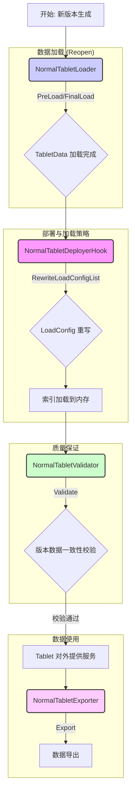

# Havenask Normal Tablet 生命周期与管理模块深度解析

**涉及文件:**
*   `table/normal_table/NormalTabletLoader.cpp`
*   `table/normal_table/NormalTabletLoader.h`
*   `table/normal_table/NormalTabletDeployerHook.cpp`
*   `table/normal_table/NormalTabletDeployerHook.h`
*   `table/normal_table/NormalTabletValidator.cpp`
*   `table/normal_table/NormalTabletValidator.h`
*   `table/normal_table/NormalTabletExporter.cpp`
*   `table/normal_table/NormalTabletExporter.h`
*   `table/normal_table/NormalTabletExportLoader.cpp`
*   `table/normal_table/NormalTabletExportLoader.h`

## 1. 概述

除了核心的读写功能外，一个完备的 `Tablet` 系统还需要一套强大的生命周期管理机制来控制其从加载、部署、验证到最终导出的整个过程。Havenask `Normal Table` 的生命周期与管理模块正是为此而生。它通过一系列高度可定制的组件，确保了 `Tablet` 在不同阶段都能被正确、高效、安全地处理。

本文将深入探讨 `NormalTabletLoader`、`NormalTabletDeployerHook`、`NormalTabletValidator` 和 `NormalTabletExporter` 这几个关键组件，分析它们在 `Tablet` 的生命周期中所扮演的角色，以及它们是如何保证系统稳定性和数据一致性的。

## 2. 核心组件在生命周期中的作用

`Tablet` 的生命周期可以看作是一系列状态的迁移，每个组件在其中的特定阶段发挥作用。



- **NormalTabletLoader**: `Tablet` 加载过程的执行者。当 `Reopen` 发生时，`Loader` 负责加载新 `Version` 中包含的 `Segment`，处理新旧 `Segment` 的合并，应用 `Operation Log` 和 `Patch`，最终生成一个可供查询的、一致的 `TabletData` 视图。它是 `Reopen` 流程的核心。
- **NormalTabletDeployerHook**: 在索引文件实际从远端（如 HDFS）下载到本地并加载到内存之前提供了一个干预点。它允许用户通过配置动态地修改 `LoadConfigList`，例如，可以根据需要禁用某些字段或索引的加载，从而节省本地磁盘空间和内存资源。这是一个非常实用的性能优化工具。
- **NormalTabletValidator**: `Tablet` 版本的质量保证员。在 `Tablet` 加载完成后、对外提供服务之前，`Validator` 会对数据的完整性和一致性进行校验，最典型的应用就是检查主键（Primary Key）是否存在重复。只有通过校验的版本才能被最终加载。
- **NormalTabletExporter** & **NormalTabletExportLoader**: 负责数据的导出。`Exporter` 提供了创建数据迭代器（`NormalTabletDocIterator`）和配置导出环境（`TabletOptions`）的能力。而 `ExportLoader` 则是一个特殊的 `Loader`，它在导出前对数据进行预处理，例如，它会模拟 `Reopen` 过程，将 `Operation Log` 中的更新应用到 `Segment` 上，从而导出一个包含所有更新的、完整的数据快照。

## 3. `NormalTabletLoader`：数据加载与一致性恢复的核心

`NormalTabletLoader` 是 `Reopen` 过程中最复杂的组件，它需要处理增量数据和实时数据之间的关系，并应用 `Operation Log` 来恢复数据一致性。

### 3.1. 主要职责

- **新旧版本协调**: 判断新加载的增量版本（`newOnDiskVersion`）和当前的实时版本（`lastTabletData`）之间的时间先后关系（通过 `Locator`），决定是保留、合并还是丢弃实时 `Segment`。
- **Segment 管理**: 合并新旧 `Segment` 列表，形成一个完整的 `Segment` 集合。
- **Patch 应用**: 调用 `NormalTabletPatcher`，将 `Patch` 文件应用到新加载的 `Segment` 上。
- **Operation Log 回放 (Redo)**: 这是 `Loader` 最核心的功能。它会创建一个 `OperationLogReplayer`，遍历 `Operation Log` 中的操作（`ADD`, `DELETE`, `UPDATE`），并通过 `NormalTabletModifier` 将这些变更应用到对应的 `Segment` 上，从而恢复出数据的一致性状态。
- **内存估算**: 提供 `EstimateMemUsed` 方法，用于在加载前预估新版本会占用的内存，为资源规划提供依据。

### 3.2. 核心实现分析

#### `DoPreLoad` 的复杂逻辑

`DoPreLoad` 是 `Loader` 的核心方法，它包含了 `Reopen` 的主要逻辑。

```cpp
// table/normal_table/NormalTabletLoader.cpp

Status NormalTabletLoader::DoPreLoad(const framework::TabletData& lastTabletData, Segments newOnDiskVersionSegments,
                                     const framework::Version& newOnDiskVersion)
{
    // ...
    _newVersion = newOnDiskVersion.Clone();

    // 1. 比较增量和实时的 Locator，判断谁更新
    auto [status, fullyFaster] = IsRtFullyFasterThanInc(lastTabletData, _newVersion);
    RETURN_IF_STATUS_ERROR(status, "failed to compare rt locator and inc locator");

    if (!fullyFaster) {
        // 如果增量比实时新，则丢弃所有实时 Segment
        TABLET_LOG(INFO, "rt is not fully faster than inc, need drop rt");
        _dropRt = true;
        _resourceMap = lastTabletData.GetResourceMap()->Clone();
    } else {
        // 如果实时比增量新，则保留实时 Segment
        TABLET_LOG(INFO, "rt is fully faster than inc, keep rt segments");
        auto [status, allSegments] = GetRemainSegments(lastTabletData, newOnDiskVersionSegments, newOnDiskVersion);
        // ...
        _newSegments = allSegments;

        // 创建一个新的 TabletData 用于后续处理
        framework::TabletData newTabletData(_tabletName);
        RETURN_IF_STATUS_ERROR(
            newTabletData.Init(_newVersion.Clone(), _newSegments, lastTabletData.GetResourceMap()->Clone()),
            "tablet data init fail");

        if (_isOnline) {
            // 2. 移除已过时的实时文档
            RETURN_IF_STATUS_ERROR(
                RemoveObsoleteRtDocs(_newVersion.GetLocator(), partialReclaimRtSegments, newTabletData),
                "create reclaim resource failed");
            
            // 3. 如果有主键，则进行 Patch 和 Redo
            if (pkConfigs.size() > 0) {
                RETURN_IF_STATUS_ERROR(
                    PatchAndRedo(newOnDiskVersion, newOnDiskVersionSegments, lastTabletData, newTabletData),
                    "redo operation and patch failed");
            }
        }
        // ...
    }
    return Status::OK();
}
```

这段代码清晰地展示了 `Reopen` 的核心决策流程：
1.  **`Locator` 比较**: `IsRtFullyFasterThanInc` 是关键决策点，它决定了实时数据的去留，是保证数据不回滚、不丢失的核心机制。
2.  **数据整合**: 根据决策结果，整合 `Segment` 列表，并创建一个临时的 `newTabletData`。
3.  **一致性恢复**: 在线模式下，通过 `RemoveObsoleteRtDocs` 和 `PatchAndRedo` 两个步骤，将 `Operation Log` 和 `Patch` 中的变更应用到 `newTabletData`，最终得到一个一致性的数据状态。

#### `PatchAndRedo` 的实现

```cpp
// table/normal_table/NormalTabletLoader.cpp

Status NormalTabletLoader::PatchAndRedo(const framework::Version& newOnDiskVersion, Segments newOnDiskVersionSegments,
                                        const framework::TabletData& lastTabletData,
                                        const framework::TabletData& newTabletData)
{
    // ... 找出需要应用 Patch 和 Redo 的 Segment ...

    // 1. 创建 Redo 所需的参数：Replayer, Modifier, PKReader
    auto [paramStatus, opReplayer, modifier, pkReader] = CreateRedoParameters(newTabletData);
    RETURN_IF_STATUS_ERROR(paramStatus, "prepare redo params failed");

    // 2. 加载 Patch 文件
    RETURN_IF_STATUS_ERROR(
        NormalTabletPatcher::LoadPatch(diffDiskSegments, newTabletData, _schema, nullptr, modifier.get()),
        "load patch failed");

    // 3. 遍历所有需要 Redo 的 Segment，回放 Operation Log
    for (auto segment : slice) {
        // ...
        // 创建 Redo 策略
        std::shared_ptr<indexlib::index::OperationRedoStrategy> redoStrategy = 
            std::make_shared<indexlib::index::TargetSegmentsRedoStrategy>(reopenDataConsistent);
        // ...
        indexlib::index::OperationLogReplayer::RedoParams redoParams = { ... };
        // 执行 Redo
        auto [status, cursor] = opReplayer->RedoOperationsFromOneSegment(redoParams, segmentId, redoLocator);
        // ...
    }
    return Status::OK();
}
```

`PatchAndRedo` 的逻辑非常清晰：先加载 `Patch`，然后回放 `Operation Log`。`OperationRedoStrategy` 的设计提供了一定的灵活性，例如 `TargetSegmentsRedoStrategy` 可以保证 `Operation` 只被应用到目标 `Segment` 上，避免了不必要的跨 `Segment` 操作。

### 3.3. 设计动机与技术风险

- **设计动机**:
    - **数据一致性**: `Loader` 的核心设计目标是在复杂的增量、实时数据并存的环境下，通过 `Locator` 比较和 `Operation Log` 回放，保证 `Reopen` 后的数据是完全一致和正确的。
    - **性能**: `PreLoad` 和 `FinalLoad` 的两阶段加载模式，允许将耗时的 `Patch` 和 `Redo` 操作放在后台 `PreLoad` 阶段，从而缩短 `FinalLoad` 的时间，减少 `Reopen` 对在线服务的影响。
    - **可恢复性**: 即使在异常情况下，只要 `Operation Log` 是完整的，`Loader` 就能从中恢复出一致的数据状态，保证了系统的健壮性。

- **技术风险**:
    - **逻辑复杂性**: `Loader` 的逻辑是整个系统中最为复杂的之一，它涉及多种数据源、多种状态和复杂的交互，任何一个环节的错误都可能导致数据不一致甚至数据丢失。
    - **`Operation Log` 膨胀**: 大量的更新操作会导致 `Operation Log` 迅速膨胀，增加 `Reopen` 时的回放时间和内存消耗。这需要依赖后台的合并（Merge）任务来及时清理和压缩 `Operation Log`。
    - **性能瓶颈**: `Operation Log` 的回放是串行的，如果 `Log` 过大，`Reopen` 时间可能会变得不可接受。

## 4. 其他管理组件

### 4.1. `NormalTabletDeployerHook`：精细化的加载控制

`DeployerHook` 提供了一个在索引加载前修改加载配置（`LoadConfigList`）的能力。这在资源受限或需要动态调整加载策略的场景下非常有用。

- **核心功能**: `RewriteLoadConfigList` 方法。
- **实现机制**: 它通过解析 `TabletOptions` 中 `disable_fields` 配置，动态地创建一个新的 `LoadConfig`，并将其插入到 `LoadConfigList` 的最前面。这个新的 `LoadConfig` 会匹配被禁用的字段/索引对应的文件路径，并设置其 `deploy` 标志为 `false`，从而阻止这些文件被下载和加载。

```cpp
// table/normal_table/NormalTabletDeployerHook.cpp

void NormalTabletDeployerHook::RewriteLoadConfigList(..., indexlib::file_system::LoadConfigList* loadConfigList)
{
    // ... 解析 disable_fields 配置 ...
    if (!disableFieldsConfig.needDisable()) {
        return;
    }
    // 将新创建的、用于禁用字段的 LoadConfig 插入到列表头部
    loadConfigList->PushFront(*disableFieldsConfig.CreateLoadConfig());
}
```

- **设计动机**: 提供一种灵活、动态、非侵入式的方式来控制索引的加载，以实现资源优化。例如，在某些查询场景下，部分字段可能完全用不到，通过此 `Hook` 就可以在不修改 `Schema` 的情况下，在线上环境中禁用它们的加载。

### 4.2. `NormalTabletValidator`：数据质量的最后防线

`Validator` 的职责单一而重要：在 `Tablet` 对外提供服务前，进行最终的数据质量校验。

- **核心功能**: `Validate` 方法。
- **实现机制**: 它会创建一个临时的、轻量级的 `Tablet` 实例，并以一种特殊优化的加载配置（只加载主键的核心数据）来打开指定版本的索引。然后，它会获取 `PrimaryKeyReader` 并调用其 `CheckDuplication` 方法来检查是否存在主键冲突。如果存在冲突，`Validate` 会返回错误，从而阻止该版本的加载。

- **设计动机**: 保证数据的基本一致性，特别是主键的唯一性。这是一个兜底机制，防止因上游处理错误（如 `Builder` 或 `Merger` 的 bug）导致脏数据流入线上系统。

### 4.3. `NormalTabletExporter` & `NormalTabletExportLoader`：安全高效的数据导出

这对组合为 `Normal Table` 提供了标准化的数据导出能力。

- **`NormalTabletExporter`**: 负责提供导出的入口和配置。`CreateTabletDocIterator` 方法返回一个 `NormalTabletDocIterator` 实例，而 `CreateTabletOptionsString` 则提供了一套专门为导出场景优化的 `TabletOptions`，例如，它会启用 `export_loader`。
- **`NormalTabletExportLoader`**: 是一个特殊的 `Loader`，在 `export_loader` 选项被启用时生效。它的 `ProcessTabletData` 方法会在导出前，完整地执行一次 `Patch` 和 `Operation Log` 的回放流程，确保导出的数据是包含了所有更新的最新状态，而不是某个 `Segment` 的原始状态。这对于需要获取数据最终一致性状态的离线任务至关重要。

- **设计动机**: 提供一个标准、可靠、一致的数据导出方案。将导出前的预处理逻辑（应用更新）封装在 `ExportLoader` 中，使得导出过程对用户透明，用户无需关心底层的 `Patch` 和 `Operation Log`，就能获取到正确的数据。

## 5. 总结

Havenask `Normal Table` 的生命周期与管理模块通过一系列各司其职的组件，构建了一个健壮、灵活、可控的管理体系。

- **`NormalTabletLoader`** 以其复杂的 `Reopen` 逻辑，成为保证数据一致性加载的核心。
- **`NormalTabletDeployerHook`** 提供了对资源加载的精细化控制能力，是性能优化的利器。
- **`NormalTabletValidator`** 作为质量门禁，保证了上线数据的基本正确性。
- **`NormalTabletExporter`** 和 **`NormalTabletExportLoader`** 则共同提供了一个可靠、一致的数据导出解决方案。

这些组件共同协作，确保了 `Tablet` 在其整个生命周期中，从诞生、加载、服务到最终消亡，都处于稳定、可控的状态。
