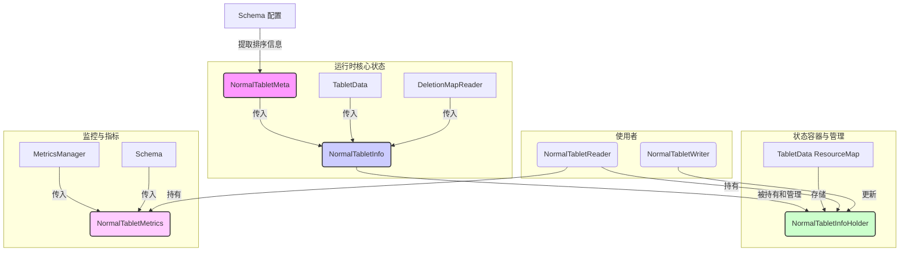

# Havenask Normal Tablet 元数据与状态模块深度解析

**涉及文件:**
*   `table/normal_table/NormalTabletMeta.cpp`
*   `table/normal_table/NormalTabletMeta.h`
*   `table/normal_table/NormalTabletInfo.cpp`
*   `table/normal_table/NormalTabletInfo.h`
*   `table/normal_table/NormalTabletInfoHolder.cpp`
*   `table/normal_table/NormalTabletInfoHolder.h`
*   `table/normal_table/NormalTabletMetrics.cpp`
*   `table/normal_table/NormalTabletMetrics.h`

## 1. 概述

在一个复杂的检索引擎中，除了核心的数据结构和算法，一套清晰、高效的元数据和状态管理体系同样至关重要。它如同引擎的“仪表盘”和“神经网络”，不仅为上层应用提供了关于 `Tablet` 状态的精确信息，也为内部的查询优化、缓存策略和监控报警提供了关键依据。

Havenask `Normal Table` 的元数据与状态模块正是扮演了这样的角色。它通过 `NormalTabletMeta`、`NormalTabletInfo`、`NormalTabletInfoHolder` 和 `NormalTabletMetrics` 这四个组件，构建了一个层次分明、功能完备的元数据管理体系。

本文将深入剖析这四个组件的职责、设计思想和核心实现，揭示它们如何协同工作，为 `Normal Table` 的稳定、高效运行提供支撑。

## 2. 核心组件协同关系

这四个组件构成了从静态配置到动态状态，再到运行时监控的完整信息链。



- **NormalTabletMeta**: 最基础、最静态的元信息。它主要从 `Schema` 中提取和封装了排序（`SortDescription`）相关的配置。这些信息在 `Tablet` 的整个生命周期中通常是固定不变的。
- **NormalTabletInfo**: `Tablet` 的核心动态状态快照。它聚合了 `NormalTabletMeta`、`TabletData` 和 `DeletionMapReader` 的信息，计算并生成了一系列对查询优化至关重要的运行时信息，例如哪些 `docid` range 是有序的、`docid` 和 `globalid` 的转换关系、历史版本的 `Segment` 排序信息等。它的实例代表了 `Tablet` 在某个特定时间点的完整状态。
- **NormalTabletInfoHolder**: `NormalTabletInfo` 的容器和管理器。它作为一个 `Resource`存在于 `TabletData` 的 `ResourceMap` 中，负责 `NormalTabletInfo` 的生命周期管理。它通过读写锁保证了 `NormalTabletInfo` 在被读取（查询时）和被更新（写入时）的线程安全性，并提供了 `Clone` 机制以支持“写时复制”（Copy-On-Write）的更新策略。
- **NormalTabletMetrics**: `Tablet` 的监控指标中心。它负责向 `MetricsManager` 注册和上报各种性能和状态指标，例如特定索引的访问次数（QPS）等。它为系统的可观测性提供了基础。

## 3. `NormalTabletMeta`：静态排序元信息

`NormalTabletMeta` 的设计非常简洁，它的职责就是封装从 `Schema` 中解析出的排序信息。

### 3.1. 主要职责

- **存储排序配置**: 持有一个 `config::SortDescriptions` 对象，这是所有排序信息的来源。
- **提供查询接口**: 提供 `GetSortPattern`、`GetSortDescription` 等接口，方便其他组件（主要是 `NormalTabletInfo` 和 `SortedDocIdRangeSearcher`）查询特定字段的排序方式。

### 3.2. 核心实现分析

其实现是一个简单的数据容器类，核心在于构造函数中接收 `SortDescriptions`。

```cpp
// table/normal_table/NormalTabletMeta.h

class NormalTabletMeta
{
public:
    explicit NormalTabletMeta(const config::SortDescriptions& sortDescs);

public:
    const config::SortDescription& GetSortDescription(size_t idx) const;
    config::SortPattern GetSortPattern(const std::string& sortField) const;
    const config::SortDescriptions& GetSortDescriptions() const;
    size_t Size() const;

private:
    config::SortDescriptions _sortDescriptions;
    // ...
};
```

- **设计动机**: 将静态的、影响全局查询行为的排序配置从复杂的 `Schema` 对象中剥离出来，形成一个独立的、轻量级的元信息对象，简化了上层逻辑对排序信息的依赖和获取方式。

## 4. `NormalTabletInfo`：动态状态快照与查询优化的基石

`NormalTabletInfo` 是元数据模块中最为核心和复杂的组件。它在 `Reader` `Reopen` 时被创建，代表了该 `Reader` 版本所对应的 `Tablet` 状态快照。

### 4.1. 主要职责

- **聚合信息**: 在 `Init` 方法中，聚合来自 `TabletData`、`NormalTabletMeta` 和 `DeletionMapReader` 的信息。
- **计算文档统计**: 初始化 `_totalDocCount`（总文档数）、`_delDocCount`（删除文档数）、`_incDocCount`（增量文档数）等统计信息。
- **识别有序范围**: 通过 `InitOrderedDocIdRanges` 方法，遍历 `Segment` 并结合 `NormalTabletMeta` 的排序信息，计算出哪些 `docid` 区间是全局有序的。这是查询时进行排序优化的关键依据。
- **管理历史版本信息**: 维护一个 `HistorySegmentInfos` 队列，记录最近几个 `Version` 的 `Segment` 列表及其排序状态。这为 `globalid` 到 `docid` 的转换提供了历史追溯能力。
- **提供 `docid` <=> `globalid` 转换**: `GetGlobalId` 和 `GetDocId` 方法是实现查询结果缓存（Result Cache）的核心。`globalid` 是一个能唯一标识一个文档在某个版本中位置的ID（通常由 `segmentid` 和 `localdocid` 组合而成）。查询时，可以将 `docid` 转换为 `globalid` 进行缓存；下次查询时，再将 `globalid` 转换回当前 `Reader` 版本的 `docid`。`GetDiffDocIdRanges` 则用于判断哪些范围因为版本变更需要重新查询。
- **动态更新**: 提供了 `UpdateDocCount` 方法，允许在实时写入（RT）场景下，只更新文档计数等少量信息，而无需重新创建整个 `NormalTabletInfo` 对象，性能更高。

### 4.2. 核心实现分析

#### 有序范围的计算

`InitOrderedDocIdRanges` 的逻辑清晰地展示了如何根据 `Segment` 的排序属性来划分 `docid` 范围。

```cpp
// table/normal_table/NormalTabletInfo.cpp

void NormalTabletInfo::InitOrderedDocIdRanges(const std::shared_ptr<framework::TabletData>& tabletData)
{
    _orderRanges.clear();
    if (_tabletMeta->Size() == 0) { // 如果没有排序字段，则所有范围都是无序的
        return;
    }
    docid_t baseDocId = 0;
    auto segments = tabletData->CreateSlice(framework::Segment::SegmentStatus::ST_BUILT);
    for (const auto& segment : segments) {
        // SegmentSortDecisionMaker 判断该 Segment 是否按照 Meta 中的描述排过序
        if (!SegmentSortDecisionMaker::IsSortedDiskSegment(_tabletMeta->GetSortDescriptions(),
                                                           segment->GetSegmentId())) {
            break; // 一旦遇到一个无序的 segment，后续所有 segment 都被认为是无序的
        }
        docid_t begin = baseDocId;
        docid_t end = begin + segment->GetSegmentInfo()->docCount;
        _orderRanges.push_back(DocIdRange(begin, end));
        baseDocId += segment->GetSegmentInfo()->docCount;
    }
}
```

这个逻辑是 `SortedDocIdRangeSearcher` 进行查询优化的基础。例如，如果查询的排序要求与 `Tablet` 的全局排序一致，那么对于有序范围内的 `docid`，引擎就可以避免进行昂贵的堆排序，直接按顺序获取即可。

#### `globalid` 转换与缓存机制

`GetDocId` 的实现揭示了缓存结果如何在新版本中被重新定位。

```cpp
// table/normal_table/NormalTabletInfo.cpp

docid_t NormalTabletInfo::GetDocId(const TabletInfoHint& infoHint, globalid_t gid) const
{
    int32_t mapOffset = 0;
    // 1. 根据查询时记录的 infoVersion，找到对应的历史版本 Segment 映射
    if (!GetHistoryMapOffset(infoHint.infoVersion, &mapOffset)) {
        return INVALID_DOCID; // 版本太老，历史信息已丢失，缓存失效
    }
    int32_t segId = gid >> 32;
    const auto& idxMap = _historySegToIdxMap[mapOffset];
    // 2. 在历史版本映射中查找该 globalid 对应的 segment 在当前版本中的索引
    auto currentIdxIter = idxMap.find(segId);
    if (currentIdxIter == idxMap.end()) {
        return INVALID_DOCID; // Segment 已被合并或删除，或排序状态改变，缓存失效
    }
    docid_t localDocId = gid & 0xFFFFFFFF;
    // ... 检查 localDocId 是否越界 ...
    
    // 3. 计算出在当前版本中的 docid
    docid_t docId = localDocId + _baseDocIds[currentIdxIter->second];
    if (_deletionMapReader && _deletionMapReader->IsDeleted(docId)) {
        return INVALID_DOCID; // 文档已被删除，缓存失效
    }
    return docId;
}
```

这个机制非常精巧，它通过 `_historySegToIdxMap` 维护了一个历史到当前的映射，使得 `globalid` 可以在不同版本间进行转换，从而实现了跨版本的缓存复用，这对于提升重复查询的性能至关重要。

### 4.3. 设计动机与技术风险

- **设计动机**:
    - **查询优化**: 提供有序范围、文档总数等信息，为上层查询优化器（如 `SortedDocIdRangeSearcher`）提供决策依据。
    - **缓存支持**: `globalid` 转换机制是实现高效查询缓存的关键技术。
    - **状态快照**: 为每一个 `Reader` 版本提供一个不变的、一致的状态快照，简化了并发环境下的查询逻辑。

- **技术风险**:
    - **信息计算开销**: `Init` 过程需要遍历所有 `Segment`，进行一系列计算，在 `Segment` 数量极多的情况下可能会有性能开销。
    - **历史信息存储**: `HistorySegmentInfos` 会存储多个历史版本的信息，虽然有 `MAX_HISTORY_SEG_INFO_COUNT` 的限制，但仍会带来额外的内存开销。

## 5. `NormalTabletInfoHolder` & `NormalTabletMetrics`

### 5.1. `NormalTabletInfoHolder`：线程安全的状态容器

`Holder` 的作用是为 `NormalTabletInfo` 提供一个线程安全的容器和管理机制。

- **核心功能**:
    - **持有实例**: 内部持有一个 `std::shared_ptr<NormalTabletInfo>`。
    - **线程安全**: 使用 `autil::ReadWriteLock` 来保护对 `_normalTabletInfo` 的访问。`GetNormalTabletInfo` 加读锁，`SetNormalTabletInfo` 加写锁。
    - **写时复制**: `UpdateNormalTabletInfo` 方法完美地体现了“写时复制”思想。它不是直接在原 `Info` 对象上修改，而是先 `Clone` 一个新的 `Info` 对象，在新对象上进行修改，最后通过 `SetNormalTabletInfo` 将 `_normalTabletInfo` 指针原子地切换到新对象上。这保证了在更新过程中，读操作（查询）可以无锁地、安全地访问旧的、一致的状态快照。

```cpp
// table/normal_table/NormalTabletInfoHolder.cpp

void NormalTabletInfoHolder::UpdateNormalTabletInfo(size_t lastRtSegDocCount)
{
    if (!_normalTabletInfo->NeedUpdate(lastRtSegDocCount)) {
        return;
    }
    // 1. 克隆一个新的 Info 对象
    std::shared_ptr<NormalTabletInfo> cloneInfo(_normalTabletInfo->Clone());
    // 2. 在新对象上更新
    cloneInfo->UpdateDocCount(lastRtSegDocCount);
    // 3. 原子切换指针
    SetNormalTabletInfo(cloneInfo);
}
```

- **设计动机**: 解决 `NormalTabletInfo` 在被高并发读（查询）和写（构建）时的线程安全问题，并采用高效的“写时复制”策略避免锁竞争，最大化读性能。

### 5.2. `NormalTabletMetrics`：系统状态的可观测性窗口

`Metrics` 的职责非常明确：收集并上报 `Tablet` 的各种监控指标。

- **核心功能**:
    - **注册指标**: 在 `Init` 方法中，根据 `Schema` 配置，向 `CounterMap` 注册各种需要监控的计数器（`Counter`），例如，为每个 `Attribute` 和 `Inverted Index` 注册访问计数器。
    - **上报指标**: 提供 `IncAttributeAccess`、`IncInvertedAccess` 等接口，供 `Reader` 在处理查询时调用，以增加相应索引的访问计数。

- **设计动机**: 提供标准化的监控接口，将 `Tablet` 的内部状态和性能数据暴露给外部监控系统（如 Prometheus、Grafana 等），实现系统的可观测性（Observability），是系统运维、性能分析和故障排查的基础。

## 6. 总结

Havenask `Normal Table` 的元数据与状态模块通过四个组件的精妙分工与协作，构建了一个从静态配置、动态快照、线程安全管理到运行时监控的完整体系。

- **`NormalTabletMeta`** 提供了基础的静态配置信息。
- **`NormalTabletInfo`** 在此基础上，结合 `TabletData` 生成了丰富的、可用于查询优化的动态状态快照。
- **`NormalTabletInfoHolder`** 则通过“写时复制”机制，为 `NormalTabletInfo` 提供了线程安全的管理容器。
- **`NormalTabletMetrics`** 最终将系统的核心状态和性能指标暴露给外部，完成了可观测性的闭环。

这一整套设计不仅保证了数据的一致性和查询的性能，也为系统的稳定性、可维护性和可扩展性奠定了坚实的基础。
